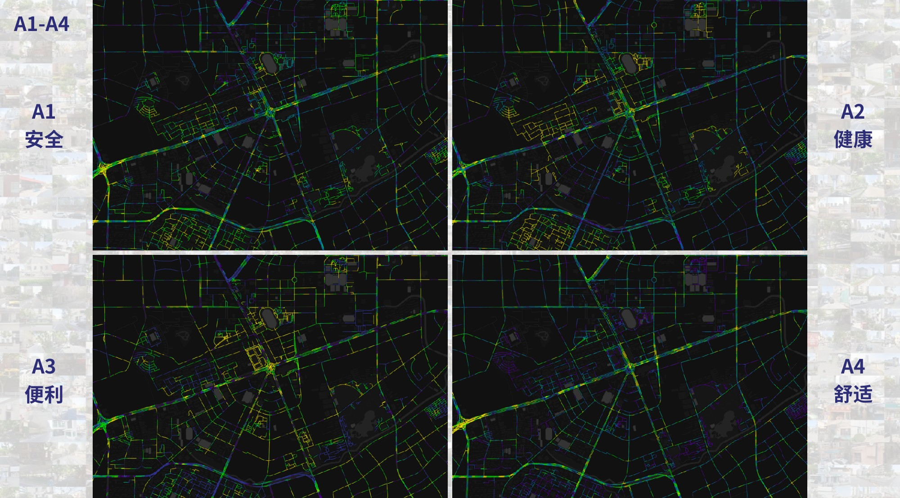
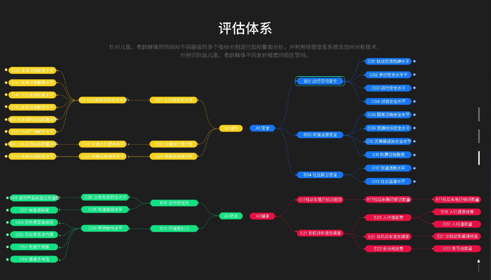

::: {.callout-note}
## Project context

**Street-environment research and assessment at CitoryTech · Shanghai · 2021** 
My role: Project lead; founder and research director of CitoryTech.
:::

# The question

How can a city identify street environments that better support children and older adults? I led this project at CitoryTech to connect the everyday requirements of these groups with **observable street conditions and access to neighborhood services**.

The work combined street imagery, computer vision, points of interest, and spatial analysis. It organized the evidence into four dimensions—safety-related conditions, health-related conditions, convenience, and comfort—so that an overall assessment could be traced back to specific features of a street.

{fig-alt="Four maps of the same Shanghai street network, showing separate indicator scores for safety, health, convenience, and comfort." loading="lazy"}

# From street observations to indicators

The framework brought together features such as sidewalk continuity and condition, crossings, curb ramps, separation from motor traffic, greenery, street furniture, and access to services. Image-derived observations and geographic measures were organized into a hierarchy of indicators.

The documented workflow divided the street network into **50-metre segments** and used nearby imagery to identify segments with visual coverage. Spatial measures were standardized against the Shanghai study area and combined through weighted aggregation. Keeping the indicator hierarchy visible allowed a reader to examine the components behind a composite score.

| Dimension | Examples of the conditions examined |
|---|---|
| Safety-related conditions | Walking continuity, crossings, separation from traffic, and accessibility features |
| Health-related conditions | Green visibility, walking and cycling space, seating, and public-space cleanliness |
| Convenience | Access to commercial, educational, medical, recreational, and public-transport facilities |
| Comfort | Street enclosure, greenery, visual character, and environmental attractiveness |

{fig-alt="Project interface with an expandable hierarchy of street-environment indicators organized into four assessment dimensions." loading="lazy"}

# My role and project output

I led the CitoryTech team’s work on the project. The materials brought together an indicator framework, spatial calculations, street-level maps, and a web assessment interface. Together, these outputs made it possible to move between an overall view of neighborhood conditions and the individual measures that informed it.

{fig-alt="Homepage of the child- and age-friendly street assessment interface developed in the project." loading="lazy"}

# Interpreting the assessment

The indicators describe features of the built environment. Image-based perception scores are **model-estimated judgments**, and the resulting maps do not by themselves establish whether a street produces better health outcomes or is experienced as safe by every child or older adult. The framework provides evidence to examine alongside field observations and the experiences of residents.

Figures: CitoryTech project materials, 2021. Related work: [StreeTalk](../streetalk/), on street-view perception modeling and pedestrian routing.
