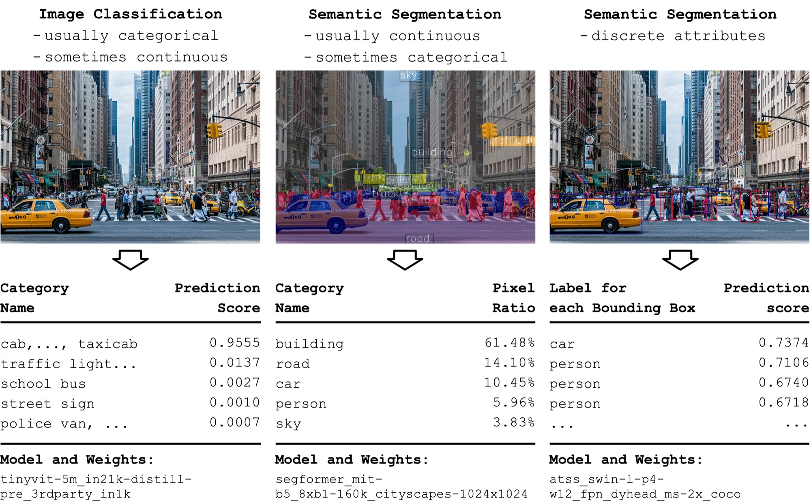
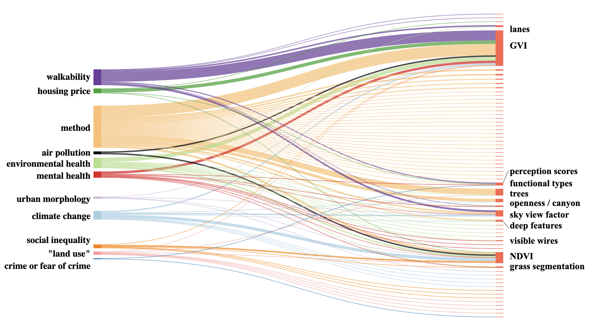

```{=html}
<style>
.quarto-title-banner {
  background-position: 50% 45%;
  height: 200px;
}
</style>
```

::: {.callout-note}
## Research context

**Independent research at MIT, coauthored with my advisor Andres Sevtsuk**

This review was my first research project after returning to academia — following my master's degree, two years in industry, and six years running CitoryTech. Before committing to a dissertation direction, I wanted a systematic account of what computer vision had actually delivered to urban studies and planning. The gaps this review identified led directly to my dissertation, [Seeing HAI](../seeing_hai/).
:::

::: {.callout-tip}
## PROJECT BRIEF

Computer vision has made street-view imagery a standard data source in urban research, but what exactly these models measure — and how well those measurements serve planning questions — has remained poorly understood outside technical circles. Written for urban planning and design researchers without a computer vision background, this review systematically analyzes **146 papers** and catalogs **104 CV-driven street attributes**, then examines a subcollection of 24 papers to assess how these attributes perform inside quantitative urban studies.

> Liu, L., & Sevtsuk, A. (2024). **Clarity or Confusion: A Review of Computer Vision Street Attributes in Urban Studies and Planning.** *Cities*, 150, 105022. [https://doi.org/10.1016/j.cities.2024.105022](https://doi.org/10.1016/j.cities.2024.105022)
:::

# The Question

---

The paper asks three related questions: What specific data can computer vision collect that interests planners and urban designers? How have planning researchers actually used these data? And what fundamentally new knowledge has computer vision contributed to planning?

Traditional observation — the tradition of Whyte, Gehl, Lynch, and Jacobs — is rich but labor-intensive and hard to repeat across a city. Computer vision promises to extend the counting and mapping of street environments with far less effort. Whether that promise has translated into clear, well-defined measures is the question the title poses.

# What the Review Covers

---

A three-stage screening of the Web of Science identified 146 influential papers, from which we extracted and classified 104 distinct street attributes into four groups:

1. **Visual Dominants** — large scene components such as greenery, sky, buildings, and roadways, mostly measured as pixel ratios from semantic segmentation.
2. **Micro-Level Details** — discrete elements such as street furniture, signs, wires, and pavement condition, typically from object detection.
3. **Composite Metrics** — indices assembled from multiple attributes, such as walkability, bikeability, and perception scores.
4. **Deep Features** — learned representations without direct physical definitions, used in perception and scene-comparison studies.



*The three data models behind CV street attributes: image classification, semantic segmentation, and object detection, each producing a different data type for urban analysis.*

The review then traces how these attributes flow into research topics — walkability, housing prices, health, climate, safety — across the quantitative studies that use them.



*How research topics (left) draw on CV-derived street attributes (right) across the reviewed literature. A small set of attributes, led by greenery, serves most topics.*

# Key Findings

---

Beyond the catalog itself, the review identifies three structural problems in the field:

- **Ambiguity of definitions.** Many attributes lack clear, consistent definitions; the same term can denote different measurements across papers.
- **Unbalanced research focus.** Effort concentrates on model and feature selection, while measurement validity and standardization receive far less attention.
- **Unclear effectiveness.** In the 24-paper subcollection, how much explanatory power street attributes add to urban models is often difficult to establish.

The review closes with recommendations for standardized measurement and clearer definitions — and it exposed a substantive gap: the attributes computer vision had delivered describe the *physical* street almost exclusively. The human activities and interactions that classic observational studies cared most about were nearly absent from the catalog. That gap became the starting point for [Seeing HAI](../seeing_hai/), my dissertation.

# Related Material

- [Seeing HAI, my dissertation research](../seeing_hai/)
- [MINGLE, the group-detection method](../mingle/)
- [Publications](../../papers/)
