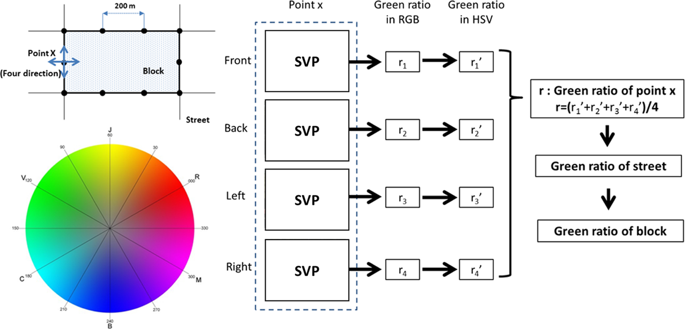
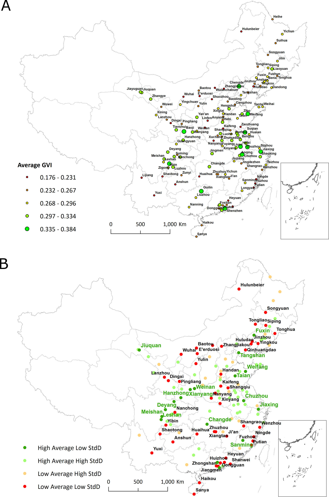

```{=html}
<style>
.quarto-title-banner { --banner-overlay: rgba(0, 0, 0, 0.7); }
</style>
```

::: {.callout-note}
## Research context

**Research collaboration with Ying Long · PLOS ONE · 2017**

[Read the paper](https://doi.org/10.1371/journal.pone.0171110)
:::

# Measuring visible greenery

How much greenery is visible from the street? We analyzed **over one million Tencent Street View images** from central areas of **245 Chinese cities**, using color analysis to estimate a green view index and aggregate it across streets and blocks.

{fig-alt="Four directional street images feed a color-based greenery measure, aggregated to streets and blocks."}

# Comparing cities

Seasonal imagery differences led us to restrict the comparative analysis to **131 cities**. The maps distinguish average greenness from its variation within each city, revealing differences that a single citywide score can hide.

{fig-alt="Two maps showing city averages and classifications by average and variation." loading="lazy"}

# Reading the measure carefully

Color-based greenery estimates can include non-vegetation objects and vary with season and lighting. They describe the sampled views, rather than total vegetation coverage or measured health outcomes.

Figures 3 and 5 from [Long and Liu (2017)](https://doi.org/10.1371/journal.pone.0171110), reproduced under [CC BY](https://creativecommons.org/licenses/by/4.0/).
