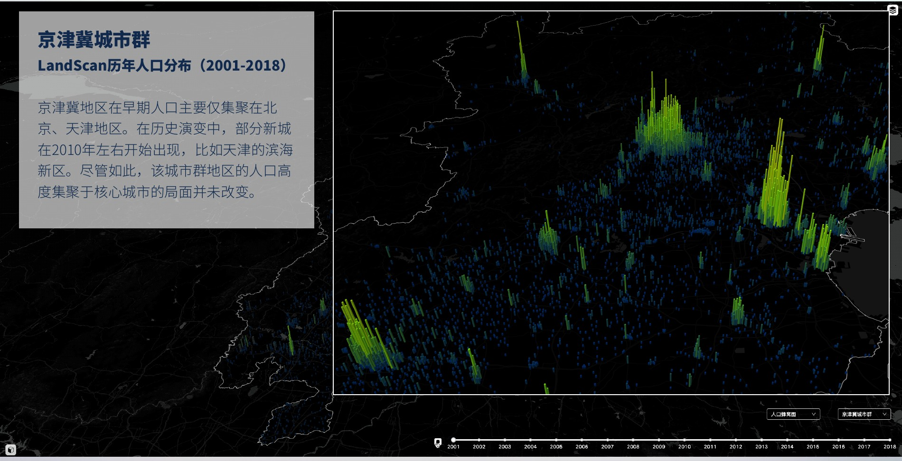
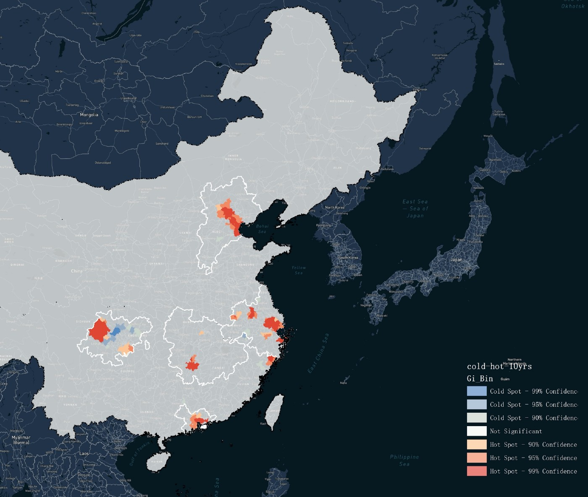
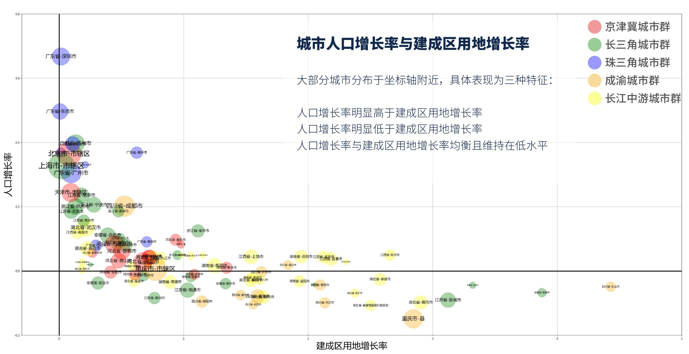

::: {.callout-note}
## Project context

**Commissioned research for Jinmao Group · CitoryTech · 2020** 
My role: Project lead; founder and research director of CitoryTech.

[Watch the population and urban growth visualization](../../visualization/#urban-growth-2020).
:::

# The question

Where were people concentrating, where was urban land expanding, and how closely did these changes align? I led this consulting project at CitoryTech to compare the development trajectories of **five major Chinese city regions**: Beijing–Tianjin–Hebei, the Yangtze River Delta, the Pearl River Delta, Chengdu–Chongqing, and the middle reaches of the Yangtze River.

The study connected a national view of population distribution with comparisons among cities, their urban cores, and surrounding areas. It gave the client a common analytical framework for examining regional differences in urban growth.

{fig-alt="Three-dimensional population grid for Beijing–Tianjin–Hebei, with high concentrations around Beijing and Tianjin." loading="lazy"}

# Data and approach

Our team combined **LandScan population grids** with **DMSP/VIIRS night-time light data**. The report examined population change over 2000–2018 and light-derived built-up-area change over 1992–2016. Regional maps, population cartograms, growth comparisons, and spatial hot-spot analysis offered complementary views of the same urban systems.

| Analytical step | What it revealed |
|---|---|
| Population distribution and change | Concentrations of people and areas of growth or decline |
| Comparisons within city regions | Differences between core cities and surrounding places |
| Built-up-area trajectories | The timing and extent of urban land expansion |
| Population–land comparison | Places where population and land growth followed different paths |

{fig-alt="Map of statistically identified population-growth hot spots and cold spots in the five Chinese city regions." loading="lazy"}

# Comparing growth trajectories

The analysis identified distinct patterns: population concentration with relatively limited land expansion, land expansion outpacing population growth, and more balanced growth at lower rates. These comparisons made it possible to examine variation within a city region alongside differences between regions.

{fig-alt="Scatterplot comparing population growth on the vertical axis and built-up-area growth on the horizontal axis, colored by city region." loading="lazy"}

# My role and project output

I led the CitoryTech team’s work on this project. The output was a comparative research report supported by maps and visual analysis, bringing population change, urban expansion, and regional structure into one discussion for the client.

The figures document the **historical study delivered in 2020**. Population grids and night-time lights are estimates of spatial conditions; their comparison describes patterns of change rather than establishing that land development caused population growth.

Figures: CitoryTech project report, 2020. Related work: [National Mobility Networks in China](../lbsn/), which examines regional connections through population movement.
