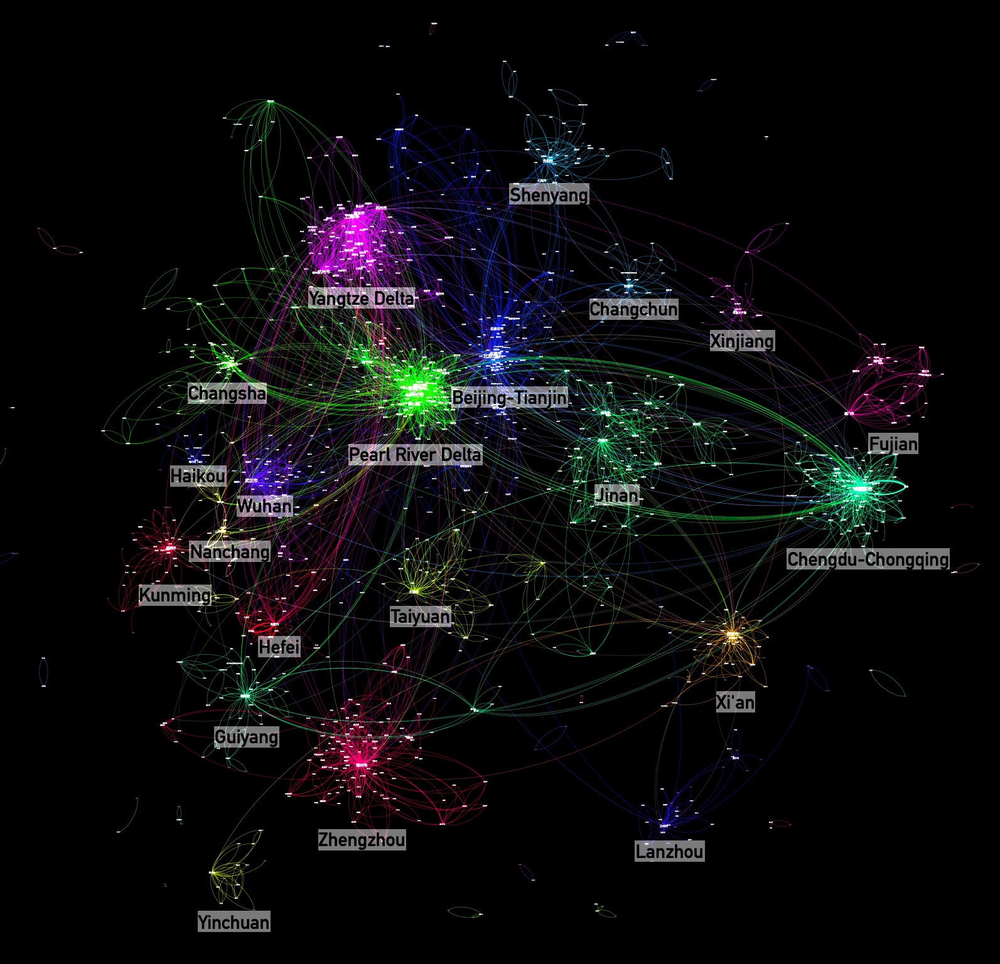
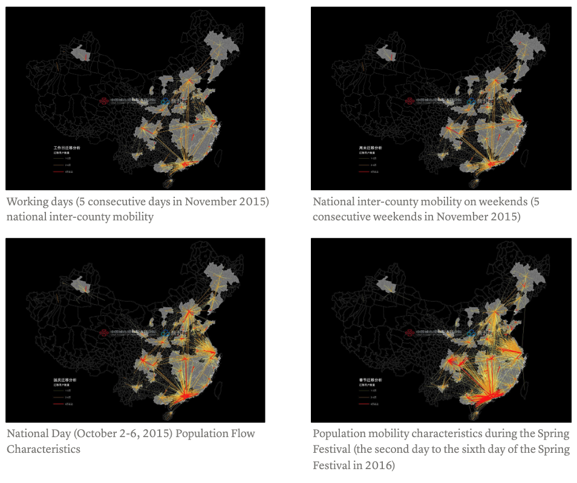
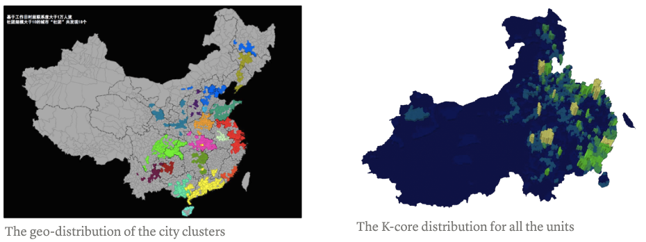

```{=html}
<style>
.quarto-title-banner {
  background-position: 50% 38%;
  height: 200px;
}
</style>
```

::: {.callout-note}
## Project context

**National-scale applied research conducted with Tencent mobility data**<br>
My role: Lead analyst responsible for geospatial analysis, network analysis, and visualization. The research began in 2015 and led to a peer-reviewed article published in 2026.
:::

# Research question

Administrative boundaries provide one view of a region, but daily mobility often connects places across those lines. This project examined whether large-scale movement networks could reveal regional structures that are clustered, overlapping, or spatially discontinuous.

The analysis used anonymized location-based social-network traces aggregated to **2,242 county-level units**. It compared population distribution and movement matrices across workdays, weekends, National Day, and the Spring Festival period.



# Analytical approach

County-level units were represented as nodes and movement between them as weighted links. Community detection identified groups of places with strong internal connections without requiring every member to share a border. Network layouts provided a second view in which geographic distance was removed and strongly connected places moved closer together.

This combination made it possible to compare three forms of regional structure:

- spatially continuous clusters that resemble familiar metropolitan regions;
- cross-boundary connections that extend beyond established planning regions; and
- enclaves or breaks produced by strong mobility links between non-adjacent places.



# Findings

The resulting communities overlap with several established urban regions, including the Beijing-Tianjin-Hebei, Yangtze River Delta, Pearl River Delta, and Chengdu-Chongqing systems. They also reveal discontinuities and long-distance ties that conventional contiguous regionalization can obscure.

Provincial boundaries remain visible in many communities, suggesting that administrative organization still shapes mobility. Other clusters extend across those borders, showing why functional regions are better treated as graded and networked rather than as fixed lines.



# Publication and earlier dissemination

> Zhang, H., Liu, L., Wang, P., & Zhao, J. (2026). "Reconceptualizing Regional Boundaries: Depicting Blurred Regions in China through Individual Mobility Data." *Computational Urban Science*, 6(1), 5. [Paper](https://doi.org/10.1007/s43762-026-00242-z)

Earlier versions of the work were presented at the [2016 China Urban Planning Annual Conference](../../presentations/#national-population-flow-analysis-based-on-1-billion-lbsn-data) and discussed in two Chinese-language essays: [City Clusters](https://mp.weixin.qq.com/s/lyplSQO_87AFrmXDa6OaZQ) and [City Flows](https://mp.weixin.qq.com/s/c1fiJPYPtpIqhijGT23Z1w).
