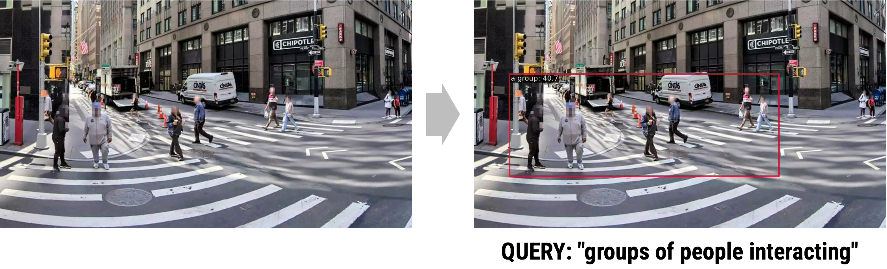
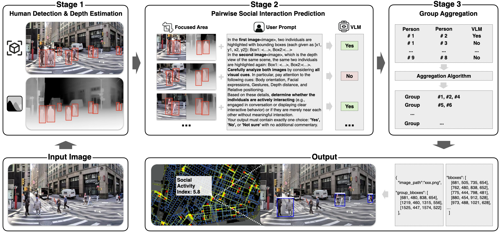
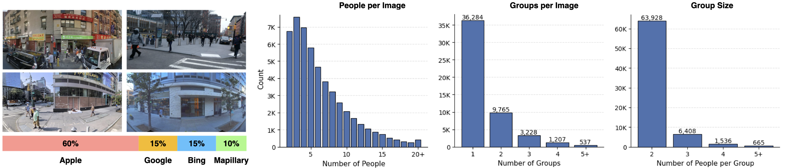

```{=html}
<style>
.quarto-title-banner {
  background-position: 50% 40%;
  height: 200px;
}
</style>
```

::: {.callout-tip}
## PROJECT BRIEF

Detecting who is interacting with whom in a city street is something humans do effortlessly — yet it remains one of the hardest tasks for computer vision. A "social group" is not a physical object with clear edges; it is a relational, emergent pattern among two or more people sharing attention, conversation, or collective movement. Standard object detectors struggle with this: they excel at finding discrete, bounded entities, but fail when the target is defined by social context rather than visual shape.

MINGLE (**M**ulti-person **I**nteraction-aware **N**eural **G**roup **L**ocalization and **E**xtraction) addresses this gap with a modular three-stage pipeline that combines human detection, depth-aware vision-language model reasoning, and spatial aggregation. The paper was accepted at **AAAI 2026** (AI for Social Impact Track) and introduces a 100K-image annotated dataset — the first of its kind — for benchmarking social group detection in urban street-view imagery.
:::

# The Problem

---

Seminal urban scholars — William H. Whyte, Jan Gehl, Allan Jacobs — established that observing where and how people gather in public space is essential to understanding urban vitality. Their insights remain foundational in urban design practice. Yet their methods required trained fieldworkers stationed at specific locations, producing data that were place-bound, labor-intensive, and impossible to scale.

Modern street-view imagery now covers billions of urban scenes worldwide. If we could automatically detect social interactions within this imagery, we could measure sidewalk sociability at the scale of entire cities — linking human co-presence to accessibility, street design, and land use in ways never before possible.

The core difficulty is semantic complexity. A social group has no fixed shape, color, or texture. It is defined by *relationships* — proximity, body orientation, shared gaze, co-movement. As the paper puts it:

> *"Detecting such groups requires interpreting subtle visual cues — proximity, body orientation, and co-movement — that transcend conventional object-detection paradigms."*

Off-the-shelf detectors return bounding boxes around individuals, not coalitions. Zero-shot prompting of large vision-language models (VLMs) like GPT-4o yields F1 scores near zero on this task. A new approach is needed.


*Figure 1. Comparison of three approaches on the same New York street scene. MINGLE (top) correctly identifies and localizes socially interacting groups with tight bounding boxes. Traditional object detection (middle) has no category for "social group." Zero-shot VLM prompting (bottom) produces noisy, unreliable results.*

A concrete illustration of why standard open-vocabulary detection fails: when queried with "groups of people interacting," a state-of-the-art open-vocabulary detector returns a single bounding box around one person — missing the social structure entirely.



*Figure 2. Open vocabulary detection given the query "groups of people interacting" (right) detects only one individual, failing to capture any social group structure.*

# The MINGLE Pipeline

---

MINGLE solves the problem in three stages, each addressing a distinct challenge:

## Stage 1 — Person Detection

An ATSS-Swin-L-DyHead detector first identifies all individual people in the scene with high-confidence bounding boxes. This separates the problem of *finding people* from the problem of *reasoning about their relationships*.

## Stage 2 — Pairwise Affiliation Classification

For every pair of detected individuals, MINGLE constructs a prompt containing:

- **RGB crops** of each person's bounding box
- A **depth-map crop** of the scene, generated by a monocular depth estimator
- **Numeric depth values and absolute depth differences** inserted directly into the text prompt

This multimodal prompt is fed to a **fine-tuned Qwen2-VL / Qwen2.5-VL** model, which classifies each pair as *interacting*, *not interacting*, or *uncertain*. The use of explicit depth cues is a key innovation: distance in the image plane is an unreliable proxy for physical proximity (due to perspective), so depth information lets the model reason about actual spatial separation between individuals.

Computational cost is managed by filtering out pairs whose image-plane distance or depth difference exceeds configurable thresholds, dramatically reducing the number of VLM calls without meaningful loss in accuracy.

## Stage 3 — Group Aggregation

A greedy clustering algorithm merges pairwise classifications into coherent group regions. Any set of two or more individuals with mutual "interacting" links forms a social group, and a single bounding box is computed from the extreme coordinates of its members. The result is a **social group region** — a new type of detection output that captures collective, relational structure rather than individual bodies.



*Figure 3. The full MINGLE pipeline (top row) and its output format (bottom row). Stage 1 detects individuals; Stage 2 classifies each person pair using depth-aware VLM prompts; Stage 3 aggregates pairs into group bounding boxes. The bottom row shows how group detections and a Social Activity Index are computed for a given street image.*

# Dataset

---

A central contribution of MINGLE is its **100K-image annotated dataset**, the first large-scale benchmark for social group detection in urban street-view imagery. Images were sourced from four providers to ensure geographic and visual diversity:

| Source | Share |
|---|---|
| Apple Look Around | 60% |
| Google Street View | 15% |
| Bing Streetside | 15% |
| Mapillary | 10% |

The dataset contains **588,430 human instances** and **72,537 annotated social group regions**, combining manual human labels with pipeline-validated pseudo-labels. A separate pairwise fine-tuning set of **79,265 annotated person pairs** was collected to train the VLM classifier (76K training / 2K test), with human labels of "Yes," "No," or "Not Sure" for each pair.



*Figure 4. Dataset composition and statistics. Left: source distribution across four street-view providers. Right: histograms of people per image, groups per image, and group size — showing the dataset covers a wide range of scene densities.*

# Results

---

MINGLE substantially outperforms all baselines:

**Pairwise classification** (Table 2 in the paper):

| Model | F1 | Precision | Recall |
|---|---|---|---|
| GPT-4o (zero-shot) | 0.00 | — | — |
| Qwen2-VL (zero-shot) | 0.53 | — | — |
| **MINGLE (fine-tuned, 76K)** | **0.70** | **0.73** | **0.66** |

**Full pipeline — social group region detection** (Table 3):

| Method | mIoU | F1 | Precision | Recall |
|---|---|---|---|---|
| Baseline VLMs | ~0.00–0.02 | — | — | — |
| **MINGLE** | **0.64** | **0.60** | **0.75** | **0.61** |

The near-zero scores for baseline VLMs confirm that off-the-shelf models cannot handle this relational, multi-entity detection task — even with strong prompting. MINGLE's pipeline design, combining specialized detection with depth-grounded pairwise reasoning, is what makes the difference.

The depth and distance filtering ablation (Table 4) shows that aggressive filtering reduces VLM calls substantially with minimal impact on accuracy, making the pipeline practical for city-scale deployment.

# Publication

---

> Liu, L., Kudaeva, A., Cipriano, M., Al Ghannam, F., Tan, F., de Melo, G., & Sevtsuk, A. (2026). **MINGLE: VLMs for Semantically Complex Region Detection.** *Proceedings of the AAAI Conference on Artificial Intelligence*, 40(45). [https://doi.org/10.1609/aaai.v40i45.41239](https://doi.org/10.1609/aaai.v40i45.41239)

arXiv preprint: [arxiv.org/abs/2509.13484](https://arxiv.org/abs/2509.13484)
