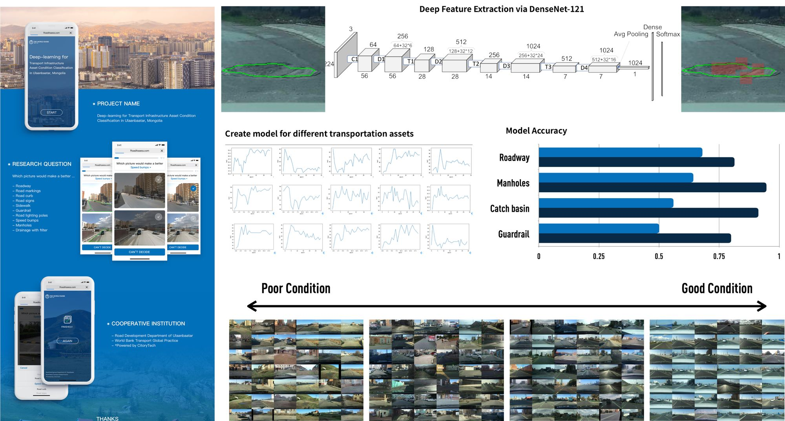

```{=html}
<style>
.quarto-title-banner {
  background-position: 50% 50%;
  height: 200px;
}
</style>
```

::: {.callout-note}
## Project context

**Commissioned applied research for the Ulaanbaatar municipal government within a World Bank-supported infrastructure program**<br>
My role: Project lead at CitoryTech, responsible for the analytical approach, system development, and delivery.
:::

# The decision problem

Ulaanbaatar needed a repeatable way to inspect road and sidewalk infrastructure across the city. Municipal vehicles already traveled through the street network and collected imagery. The project converted those images into a condition-monitoring system that could help staff decide where field inspection and selective repair were most urgent.

The system evaluated nine types of road and transportation assets, including pavement damage, sidewalks, curbs, road markings, signs, manholes, and guardrails. Each detected asset was assigned a condition category and linked to its road segment. Maintenance priority could then consider both physical condition and the importance of the location, including how many people were likely to use it.

# My role and delivery

The World Bank introduced our team to the municipal client. I led the project through method design, model development, system integration, and delivery. The final product was a monitoring platform with an interactive map, color-coded road segments, and image-level evidence for the assessed assets.

This format allowed staff to move from a citywide overview to individual locations rather than relying on a single aggregate score. The analytical output was designed to support maintenance prioritization, reporting, and targeted field verification.



# Method and limitations

The workflow combined asset detection with condition assessment. Labeled images supplied the training data, while geo-referenced predictions connected each observation to the road network and the monitoring interface.

The model's coverage was limited to the asset categories represented in the training data. Adding a new asset type, or encountering a substantially different image source, required new labels and model evaluation. We treated the platform as an updateable inspection aid rather than a replacement for municipal judgment or field checks.

# Publication

> Zhang, D., Yi, H., Chen, Y., Jiang, N., Shao, J., & Liu, L. (2022). "An Urban Infrastructure Assessment System Built on Geo-Tagged Images and Machine Learning." *Computational Urban Science*, 2(1), 1–21. [Paper](https://doi.org/10.1007/s43762-022-00056-9)

# Platform demonstrations








