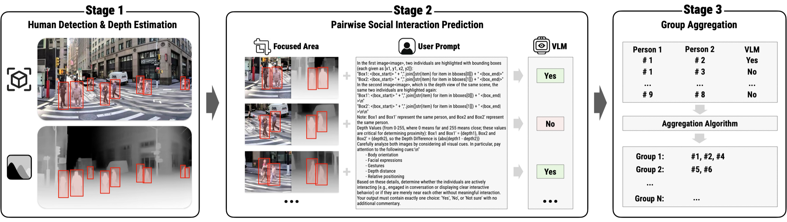
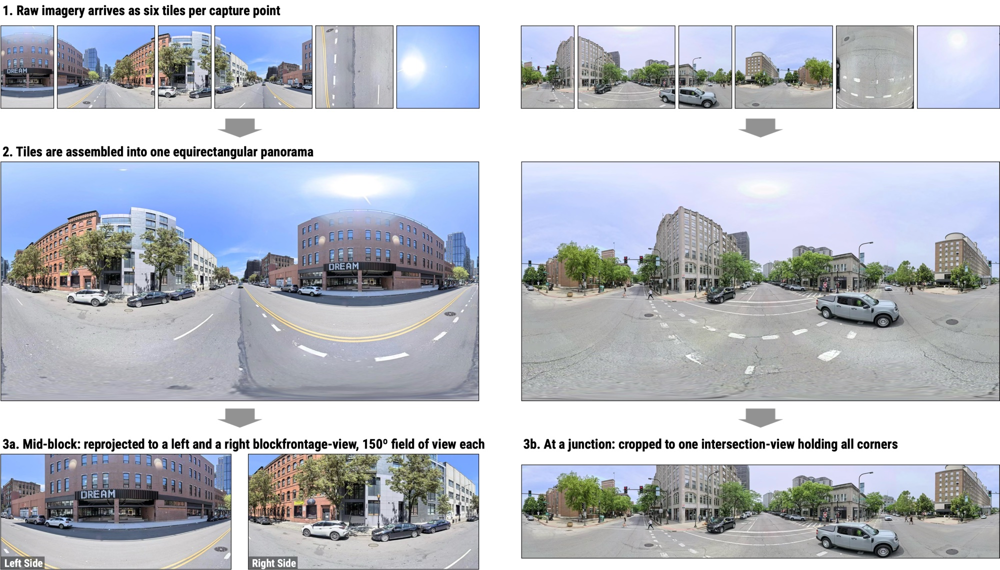
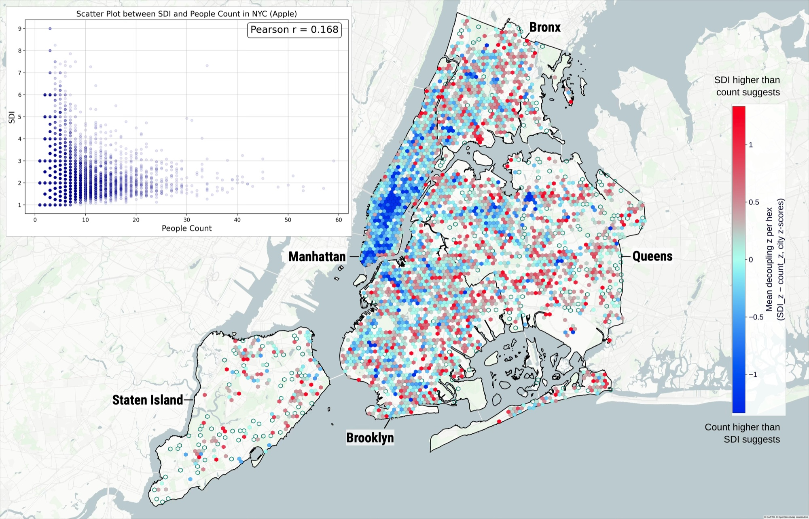
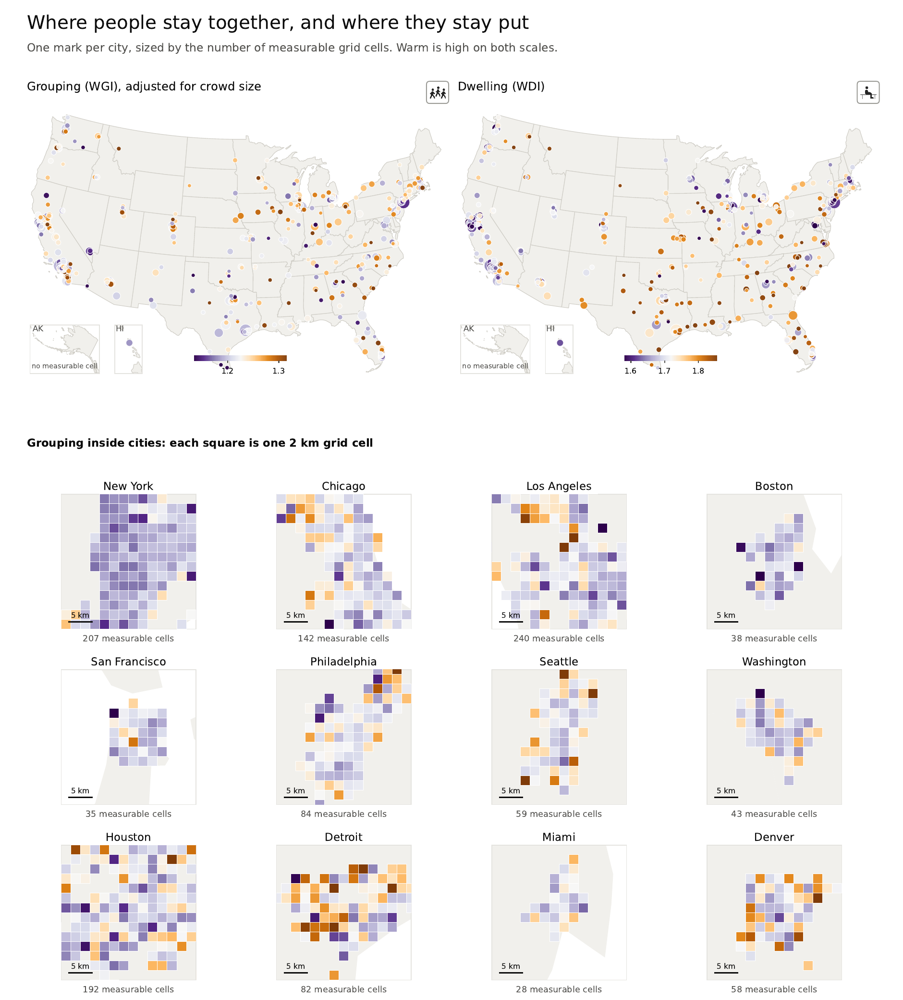

```{=html}
<style>
.quarto-title-banner {
  background-position: 50% 45%;
  height: 220px;
}
</style>
```

::: {.callout-note}
## Research context

**Ph.D. dissertation research, MIT Department of Urban Studies and Planning**<br>
Committee: Andres Sevtsuk (chair), Jinhua Zhao, Lawrence Vale · Expected completion: June 2027

*Seeing HAI* is the title and organizing framework of my dissertation. It is distinct from [Sidewalk Ballet](../sidewalk_ballet/), a City Form Lab collaboration and public installation that I lead at MIT. The two projects intersect, but they have different scopes, research ownership, and outputs.

**[Approved dissertation proposal (PDF)](https://www.dropbox.com/scl/fi/6b0csugj5mr8n1u4bc98u/Dissertation-Research-Proposal-250423_Liu.pdf?rlkey=e3w0m8vrksbr1ewnh8ydruhxv&st=ff0xemho&dl=0)** — the document is password-protected; please [email me](mailto:lyons66@mit.edu) for the password.
:::

# Research Question

---

Pedestrian counts describe how many people move through a street, but they do not show whether people stop, talk, rest, vend, play, or spend time together. Two sidewalks can carry similar foot traffic while supporting very different forms of public life. My dissertation asks how visual AI can extend close observation of these activities across cities without allowing a model's available labels to define what matters.

The research combines ideas from urban studies with computer vision, vision-language models, and geospatial analysis. Its aim is to produce measures that remain interpretable as they move from individual street images to sidewalk segments and city-scale comparisons.

# How This Research Came Together

---

The dissertation did not begin as a dissertation. It grew out of a sequence of projects, each of which exposed the question the next one had to answer.

1. **Mapping the field.** My first project after returning to academia was [*Clarity or Confusion*](../clarity/), a systematic review of computer vision street attributes published in *Cities* (2024). Cataloging 104 attributes across 146 papers made one gap unmistakable: computer vision had learned to describe the physical street in detail, while the human activities and interactions that classic observational studies cared most about were nearly absent.

2. **Encountering the problem.** Through [Sidewalk Ballet](../sidewalk_ballet/), the City Form Lab collaboration I lead at MIT, I began working directly on detecting social activity in street imagery — and found that no existing method handled its central difficulty well. A social group is not an object with visual edges; it is a relationship among people. That unsolved problem became the seed of the dissertation.

3. **Building the missing method.** [MINGLE](../mingle/), published in the **AAAI 2026 AI for Social Impact Track**, solved the group-detection prerequisite: it combines person detection, depth-aware vision-language reasoning, and group aggregation to identify socially interacting groups, trained and evaluated on **79,265 human judgments** with annotations released for **100,000 urban street images**. MINGLE bridges the lab collaboration and the dissertation; with it in place, the dissertation proper could begin.



*The three-stage group detection approach: person detection with depth estimation, pairwise interaction prediction by a vision-language model, and aggregation into social groups.*

# The Dissertation: Method, Findings, Data

---

The dissertation develops in three connected parts. Each takes the same underlying framework — reconstructing sidewalk-facing views from street-level panoramas and coding each visible person across ten observable dimensions, including social grouping, posture, mobility state, and activity — and pushes it in a different direction.

## Method: A Vision-Language Framework for Measuring Social Life on Sidewalks

The method paper builds the measurement instrument. Timestamped street-level panoramas are reprojected into sidewalk-facing sideviews, and a VLM-based system codes each visible person across ten independent observable dimensions — a design that resolves a systematic failure mode in which models prompted with high-level social categories conflate what is visible with what is inferred. The framework distills each image into a small set of interpretable indices: a **Social Dwelling Index (SDI)** that jointly considers grouping and dwelling, activity labels documenting behavioral diversity, and flags for accessibility-sensitive populations.



*From panorama to sideview: raw camera tiles are stitched into panoramas and reprojected into sidewalk-facing views that preserve the pedestrian realm on each side of the street.*

Applied to **102,514 sideviews in New York City**, the framework shows that pedestrian volume and social activity are nearly uncorrelated (*r* = 0.168): the streets with the highest foot traffic are not where social life is most intense. The manuscript, *A Vision-Language Framework for Measuring Social Life on Sidewalks*, is under review at *Computers, Environment and Urban Systems*.



*The decoupling of pedestrian volume and social activity in New York City. Blue areas — including Midtown Manhattan — carry more foot traffic than their social activity suggests; red areas host more social life than their counts would predict.*

## Findings: What Kinds of Streets Support Social Life (in progress)

The findings paper applies the method across New York City's full street network, converting Apple and Bing street-level imagery into activity and interaction indices, and examines how they relate to sociodemographic context, street design, and land-use functionality. This part of the dissertation is ongoing; the website reports it as a research plan rather than as completed empirical findings.

## Data: Stay Together — 496 U.S. Cities

The data paper scales the collection nationally. It documents a dataset derived from **7,139,672 timestamped views** from Apple Look Around and Bing Streetside across **496 U.S. cities**, organized into 3.7 million block frontages with intersection views kept separate, and spanning weekday and weekend, midday and evening capture windows from 2011 to 2025. Alongside the resource, the draft reports exploratory patterns — for example, at a fixed number of detected people, views from denser tracts less often show those people together as one group. The derived data are being prepared for public release; the manuscript, *Stay Together: Street-Level Social Indicators for Sidewalk Life Across 496 U.S. Cities*, is in preparation.



*Where people stay together, and where they stay put: grouping and dwelling indices across 496 U.S. cities, with 2-km grid detail for the twelve largest.*

# The Great Streets Visualization

---

*The Great Streets* is a working interface for moving between citywide patterns and the street-level observations behind them. The prototype connects segment-level indicators in a 3D map with source street-view images and person-level activity and interaction labels. This makes the measurement pipeline inspectable: a user can select a street segment, compare observations across imagery sources and times, and trace an aggregate value back to the visible evidence.

<figure class="project-video-figure">
  <video controls playsinline preload="metadata" poster="great_streets_poster.jpg" aria-label="Screen recording of The Great Streets visualization">
    <source src="great_streets_visualization.mp4" type="video/mp4">
    Your browser does not support embedded video.
  </video>
  <figcaption>Screen recording of the prototype using New York City data. The interface links segment-level indicators, 3D context, source imagery, and visual labels.</figcaption>
</figure>

# Related Material

- [Clarity or Confusion, the literature review that framed this research](../clarity/)
- [MINGLE project and paper](../mingle/)
- [Sidewalk Ballet, a separate City Form Lab collaboration](../sidewalk_ballet/)
- [Publications](../../papers/)
- [Dissertation colloquium and research presentations](../../presentations/)
