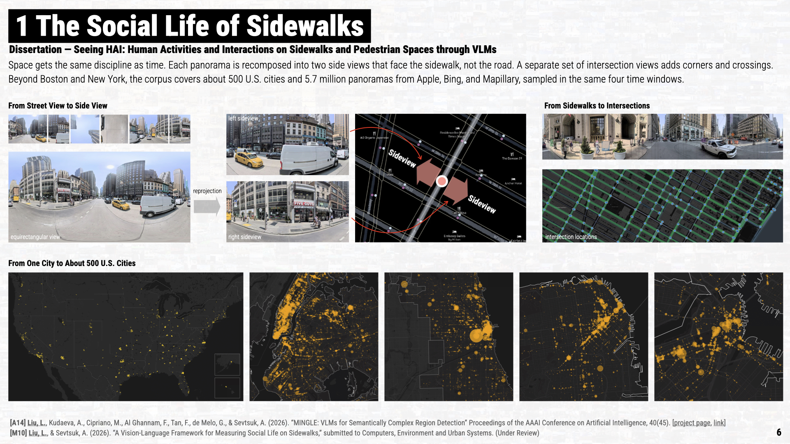
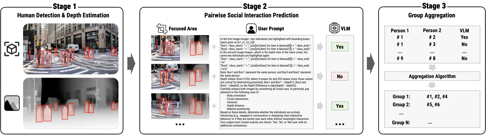
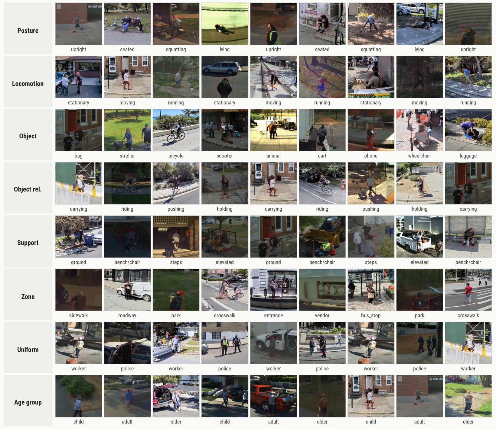
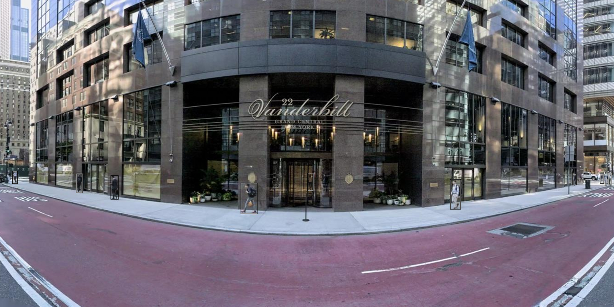
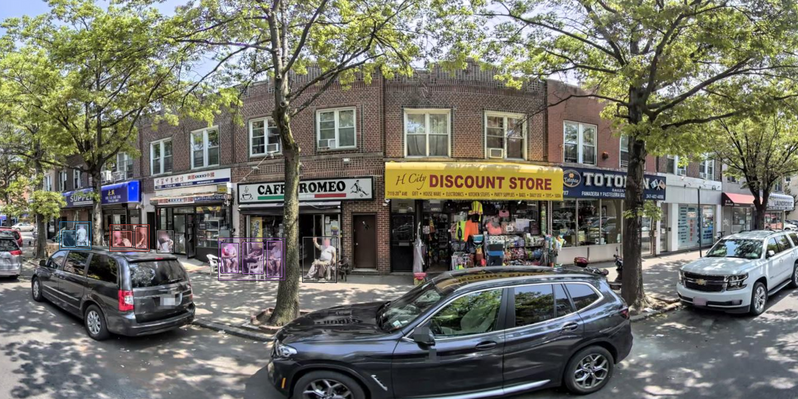
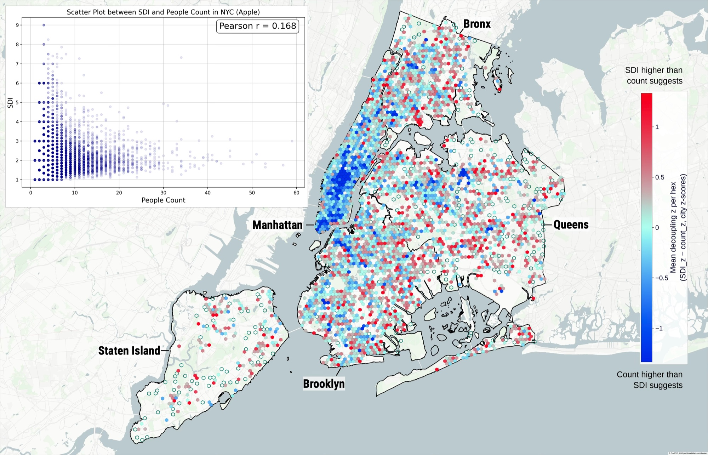
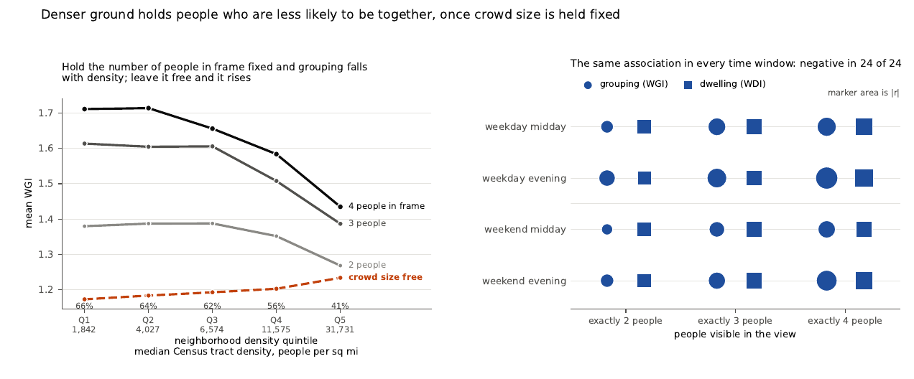
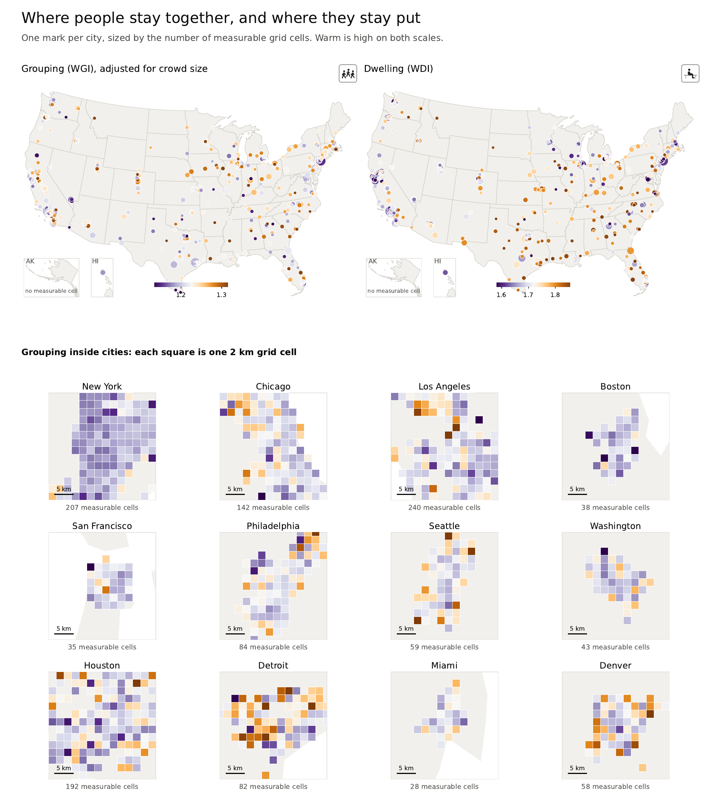

```{=html}
<style>
.quarto-title-banner {
  background-position: 50% 45%;
  height: 220px;
}
.sdi-comparison {
  display: grid;
  grid-template-columns: repeat(2, minmax(0, 1fr));
  gap: 1.2rem;
  margin: 1.2rem 0;
}
.sdi-comparison figure { margin: 0; }
.sdi-comparison img { width: 100%; height: auto; }

.slide6-crop { position: relative; display: block; overflow: hidden; width: 100%; aspect-ratio: var(--crop-w) / var(--crop-h); }
.slide6-crop img { margin: 0 !important; border: 0; position: absolute; display: block; width: calc(1920 / var(--crop-w) * 100%); max-width: none !important; height: auto; left: calc(var(--crop-x) / var(--crop-w) * -100%); top: calc(var(--crop-y) / var(--crop-h) * -100%); }
.slide6-figure { margin: 1.2rem 0 1.6rem; }
.slide6-figure figcaption { margin-top: .6rem; color: var(--site-muted); font-size: .85rem; line-height: 1.5; }
.measurement-table { max-width: 100%; overflow-x: auto; }
@media (max-width: 640px) {
  .sdi-comparison { grid-template-columns: 1fr; }
  #quarto-document-content .measurement-table th,
  #quarto-document-content .measurement-table td { padding: 0.5rem 0.35rem; }
}
</style>
```

::: {.callout-note}
## Research context

**Ph.D. dissertation research, MIT Department of Urban Studies and Planning**<br>
Committee: Andres Sevtsuk (chair), Jinhua Zhao, Lawrence Vale · Expected completion: June 2027

*Seeing HAI* is the title and organizing framework of my dissertation. It is distinct from [Sidewalk Ballet](../sidewalk_ballet/), a City Form Lab collaboration and public installation that I lead at MIT. The two projects intersect, but they have different scopes, research ownership, and outputs.

**[Approved dissertation proposal (PDF)](https://www.dropbox.com/scl/fi/6b0csugj5mr8n1u4bc98u/Dissertation-Research-Proposal-250423_Liu.pdf?rlkey=e3w0m8vrksbr1ewnh8ydruhxv&st=ff0xemho&dl=0)** — the document is password-protected; please [email me](mailto:lyons66@mit.edu) for the password.
:::

# Research Question

---

A sidewalk is a place to sit, talk, linger, work, care for others, and take part in public life. It is also a shared space where strangers from different backgrounds can encounter one another. Pedestrian counts alone reveal little about these activities: two sidewalks can carry similar foot traffic while supporting very different forms of public life. My dissertation asks how visual AI can extend close observation of sidewalk life across cities while keeping its measures grounded in what images can actually show.

I see this as a lifelong research program, with the dissertation laying its foundation. The first complete sequence now runs from **raw street imagery, through observations of people and groups, to GIS-based spatial analysis**. Each stage continues to evolve, but the connection makes it possible to trace a city-scale measure back to the people, places, and visible evidence from which it was constructed.

# The Dissertation: Method, Findings, Data

---

The dissertation develops in three connected parts: **Method** builds a measurement framework, **Findings** examines spatial patterns in New York City, and **Data** extends the observation to cities across the United States. A shared pipeline combines two parallel branches, social-group detection and per-person attribute coding, before constructing indicators for spatial analysis.

{fig-alt="Five-stage workflow showing street panoramas reprojected into sideviews, parallel group and per-person attribute detection, validity filtering and cross-branch refinement, indicator construction, and New York City maps." loading="lazy"}

## Method: A Vision-Language Framework for Measuring Social Life on Sidewalks

**[Read the arXiv preprint](https://arxiv.org/abs/2609.28476)** · Liu Liu and Andres Sevtsuk · Under review at *Computers, Environment and Urban Systems*.

### Capture time and place

Observing people requires knowing when an image was captured. Collection therefore uses imagery with explicit capture timestamps, organized into four windows: weekday and weekend, each at **12:00–14:00 and 17:00–19:00**. This preserves the time of the observed activity, rather than treating imagery as a timeless record of the street. The broader collection includes Apple Look Around, Bing Streetside, and Mapillary; the national data paper below uses the Apple and Bing subset.

### From street view to side view {#align-imagery-with-the-street-network}

Each panorama is reprojected into **left and right sideviews that face the sidewalks**, with a 150° field of view and a 1600 × 800 pixel frame. The example below connects the source panorama and its two resulting photographs to the **capture point, road direction, and opposite viewing directions on the street network**. Keeping that relationship explicit preserves which side of the street each image observes.

<figure class="slide6-figure">
  <a class="lightbox slide6-crop" href="page6_spatial_overview.jpg" data-gallery="page6-spatial" data-title="Spatial workflow and collection overview from my dissertation presentation. Current data-paper scope is described below." style="--crop-x:20; --crop-y:275; --crop-w:1260; --crop-h:316;">
    
  </a>
  <figcaption>From street view to side view: the red arrows connect the two photographs to their sidewalk-facing directions on the road network. Click to view the full presentation figure.</figcaption>
</figure>

### From sidewalks to intersections

Intersections need a different frame. A wide view retains the corners and crossings together; the accompanying map shows intersection observation locations on the street network. These observations remain separate from the two-sided mid-block views.

<figure class="slide6-figure">
  <a class="lightbox slide6-crop" href="page6_spatial_overview.jpg" data-gallery="page6-spatial" data-title="Spatial workflow and collection overview from my dissertation presentation. Current data-paper scope is described below." style="--crop-x:1318; --crop-y:275; --crop-w:586; --crop-h:316;">
    
  </a>
  <figcaption>An intersection panorama and the corresponding collection of intersection locations on the street network. Click to view the full presentation figure.</figcaption>
</figure>

For spatial analysis, sidewalk-facing views are assigned to side-specific block frontages on the TIGER/Line road network, while intersection records retain their junction association. View and frontage identifiers, capture time, and the crosswalk to road segments connect the visual observations to land use, transportation, and demographic data.

### Identify social groups

A group has no single visual boundary. Occlusion, depth differences, and the absence of motion make it difficult to distinguish people together from people who happen to be close. Building on MINGLE, the method replaces its person detector with **SAM3**, improves depth estimation with **PatchFusion**, and uses a fully fine-tuned vision-language model to judge pairs before assembling them into groups.

The published preprint reports an expanded **76K training corpus** and a final **Qwen2.5-VL-3B** pairwise model with **F1 = 80.64%**. This is the group-detection branch of the dissertation framework; it extends the earlier MINGLE paper.

{fig-alt="A street scene and depth map feed cropped person-pair comparisons, whose interaction judgments are aggregated into social groups." loading="lazy"}

### Code each person's visible attributes

In parallel, **Qwen3-VL-30B-A3B-Instruct** queries each person using a structured vocabulary of **ten fields**: validity, posture, locomotion, object, object relation, support surface, zone type, uniform presence, apparent age group, and model-perceived sex. A person walking while holding a phone is coded through separate locomotion, object, and object-relation fields, avoiding the ambiguity of a single high-level activity label. In the public preprint, this coding model achieves **88.5% mean field accuracy on 999 held-out pedestrian samples**.

The vocabulary draws on the observational work of Whyte and Mehta. It separates visible evidence from interpretations of intent, relationships, or social meaning. Apparent age group and model-perceived sex remain exploratory outputs rather than demographic ground truth; sex is excluded from primary analyses because provider face blurring makes it structurally unreliable.

{fig-alt="A grid of street-image examples organized by eight attribute fields, illustrating seated and moving people, objects such as strollers and bicycles, and sidewalk contexts." loading="lazy"}

### Refine and combine the two branches

The two branches inform one another. A validity filter removes detections such as people in advertisements, inside vehicles, or outside the target pedestrian space before groups are rebuilt. Group-level consistency helps refine locomotion labels, and the resulting group IDs are joined to the per-person attributes. The output retains both person-level evidence and image-level records with location and capture time.

Rule-based combinations then produce grouping and dwelling indices, activity and spatial-context flags, and indicators relevant to accessibility. This step makes explicit how a model reading becomes a measure used in urban analysis.

### Build interpretable measures

Three image-level indices summarize the resulting observations. For an image containing $N$ observed people, each person receives a grouping weight $\alpha$: **1 for a solo person, 2 for a dyad, and 3 for a group of three or more**. The dwelling weight $\beta$ is **3 for stationary, seated people who are not riding; 2 for stationary, non-seated people; and 1 otherwise**. These are ordinal weights, with sensitivity checks reported in the method paper.

::: {.measurement-table tabindex="0" role="region" aria-label="Definitions of the three sidewalk activity indices"}
| Index | Definition | What it summarizes |
|---|---|---|
| Weighted Grouping Index (WGI) | $\frac{1}{N}\sum_{i=1}^{N}\alpha_{g(i)}$ | Grouping composition |
| Weighted Dwelling Index (WDI) | $\frac{1}{N}\sum_{i=1}^{N}\beta_{s(i)}$ | Observable dwelling posture |
| Social Dwelling Index (SDI) | $\frac{1}{N}\sum_{i=1}^{N}\alpha_{g(i)}\beta_{s(i)}$ | Grouping and dwelling combined for each person |
:::

These indices describe **visible configurations in a static image**. They do not establish how long someone stayed, why they were there, or the quality of their social experience. SDI averages the per-person products of grouping and dwelling weights, so scenes with similar pedestrian counts can have different values.

:::: {.sdi-comparison}
::: {.sdi-example}
{fig-alt="Street-view example of a commercial corner with dispersed pedestrians, with nine detected people and SDI 1.11." loading="lazy"}
:::
::: {.sdi-example}
{fig-alt="Street-view example of a neighborhood storefront with more grouped dwelling, with nine detected people and SDI 4.89." loading="lazy"}
:::
::::

Applied to **102,514 sideviews in New York City**, pedestrian count and SDI have a weak image-level correlation (*r* = 0.168). The distinction supports examining grouping and dwelling alongside counts when describing observed sidewalk activity.



*Standardized differences between pedestrian count and SDI in New York City. Blue areas have relatively higher counts than SDI; red areas have relatively higher SDI than counts.*

## Findings: What Kinds of Streets Support Social Life (in progress)

Preliminary block-frontage models compare pedestrian count with WGI, WDI, and SDI across New York City, examining their relationships with sociodemographic context, street design, and land use. Factors associated with higher counts are not consistently associated with more grouping or dwelling, suggesting that these measures capture related but distinct dimensions of observed street activity.

This analysis is ongoing. The results are descriptive rather than causal, and remain sensitive to imagery coverage, model uncertainty, and spatial dependence.

## Data: Stay Together — 496 U.S. Cities

**Manuscript in preparation** · Liu Liu and Andres Sevtsuk · 2026

The collection extends from individual street views to a national corpus. The presentation's coverage maps show the United States and closer views of New York City, Chicago, San Francisco, and Boston. They describe imagery collection; the data paper's analytical subset and counts are specified below.

<figure class="slide6-figure">
  <a class="lightbox slide6-crop" href="page6_spatial_overview.jpg" data-gallery="page6-spatial" data-title="Spatial workflow and collection overview from my dissertation presentation. Current data-paper scope is described below." style="--crop-x:20; --crop-y:662; --crop-w:1884; --crop-h:315;">
    
  </a>
  <figcaption>From one city to a national corpus: imagery coverage at national and city scales. Click to view the full presentation figure.</figcaption>
</figure>

*Stay Together: Street-Level Social Indicators for Sidewalk Life Across 496 U.S. Cities* carries the measurement framework into a national research resource across **496 U.S. cities**. The assembled panel contains **7,139,672 timestamped views** from Apple Look Around and Bing Streetside. Its **5,692,332 sidewalk-facing views** are organized into **3,725,328 block frontages**, with identifiers and a crosswalk to TIGER/Line road segments. A separate file retains **1,447,340 intersection views** as individual observations, rather than combining them with frontages. This structure supports linkage to other spatial datasets and aggregation at units chosen by the researcher.

Capture dates span **2011–2025**, organized into four observation windows: weekday and weekend, each at midday (12:00–14:00) and evening (17:00–19:00). Mapillary imagery was also collected but is excluded from this paper's analyses and planned release of indices: its uncontrolled capture geometry prevented almost all of those images from being assigned to a block frontage.

The analysis examines **grouping (WGI)** and **visible posture and locomotion (WDI)** separately. SDI is included in the planned release but is not used in this paper's empirical analysis. A central methodological finding concerns crowd size: a view showing one person necessarily has WGI = 1, so comparisons that pool different person counts can reverse the apparent relationship between grouping and neighborhood density.

Holding the detected count at **exactly two people**, the share classified as one group falls from **38.0% in the lowest tract-density quintile to 26.8% in the highest**. These are descriptive patterns in the available imagery, not evidence that density causes people to socialize less. They demonstrate why comparison requires attention to both the measurement and the composition of the observations.

{fig-alt="Two-panel analysis showing mean WGI across density quintiles at fixed person counts, alongside negative correlations of density with WGI and WDI within each person-count and time-window combination." loading="lazy"}

Coverage remains sparse: people were detected on **430,984 frontages (11.6%)**, and grouping and dwelling are undefined on the rest. The median frontage has one view. Coverage is opportunistic, and the national sample has not received an independent annotation audit. The records therefore support research on observed configurations, rather than validated rankings of places.

The panel is assembled and in use. **Derived tables, schemas, and documentation are being prepared for public release**; source imagery will not be redistributed.

{fig-alt="National maps of grouping and dwelling across measurable 2-kilometer grid cells, with detailed grouping maps for twelve selected cities." loading="lazy"}

# The Great Streets Visualization

---

*The Great Streets* is a working interface for moving between citywide patterns and the street-level observations behind them. The prototype connects segment-level indicators in a 3D map with source street-view images and person-level activity and interaction labels. This makes the measurement pipeline inspectable: a user can select a street segment, compare observations across imagery sources and times, and trace an aggregate value back to the visible evidence.

<figure class="project-video-figure">
  <video controls playsinline preload="metadata" poster="great_streets_poster.jpg" aria-label="Screen recording of The Great Streets visualization">
    <source src="great_streets_visualization.mp4" type="video/mp4">
    Your browser does not support embedded video.
  </video>
  <figcaption>Screen recording of the prototype using New York City data. The interface links segment-level indicators, 3D context, source imagery, and visual labels.</figcaption>
</figure>

[Explore more project visualizations](../../visualization/#project-visualizations).

# How This Research Came Together

---

Three earlier projects shaped the dissertation's questions and methods:

1. **Mapping the field.** [*Clarity or Confusion*](../clarity/), my review in *Cities* (2024), cataloged 104 street attributes across 146 papers. It found detailed measures of physical environments, but few of the human activities and interactions central to observational urban research.

2. **Encountering the problem.** In [Sidewalk Ballet](../sidewalk_ballet/), the City Form Lab collaboration I lead at MIT, detecting social activity exposed a methodological gap: a social group is defined by relationships among people rather than the visual boundaries of an object.

3. **Building a foundation.** [MINGLE](../mingle/), published in the **AAAI 2026 AI for Social Impact Track**, combines person detection, depth-aware pairwise reasoning, and group aggregation. This precursor connects the lab collaboration to the dissertation's broader study of activities, interactions, and their spatial patterns.

# Related Material

- [Clarity or Confusion, the literature review that framed this research](../clarity/)
- [MINGLE project and paper](../mingle/)
- [Sidewalk Ballet, a separate City Form Lab collaboration](../sidewalk_ballet/)
- [Publications](../../papers/)
- [Dissertation colloquium and research presentations](../../presentations/)
