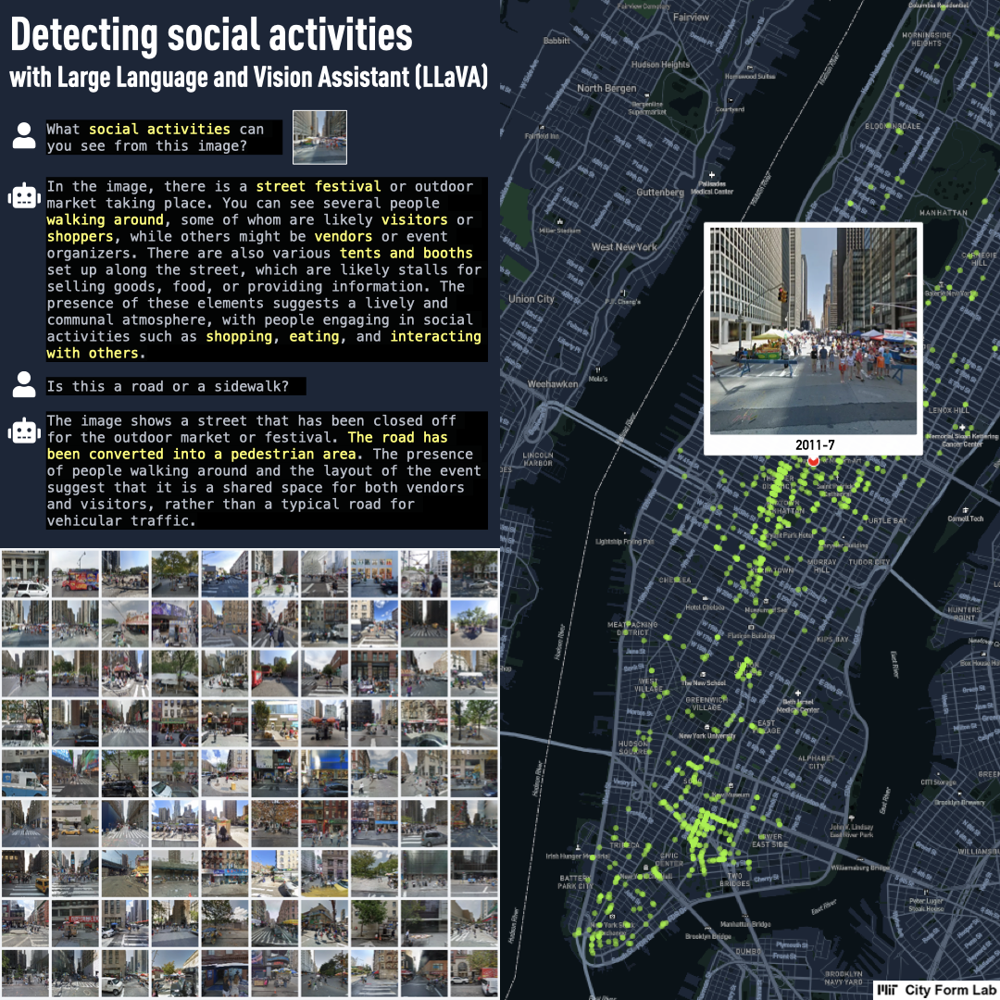

```{=html}
<style>
.quarto-title-banner {
  background-position: 50% 38%;
  height: 200px;
}
</style>
```

::: {.callout-note}
## Research context

**MIT City Form Lab and Hasso Plattner Institute collaboration**<br>
My role: Sidewalk Ballet project lead at MIT

Sidewalk Ballet is a collaborative lab project and public installation. It is not the title of my dissertation. My independent doctoral research is [*Seeing HAI: Human Activities and Interactions on Sidewalks and Pedestrian Spaces through VLMs*](../seeing_hai/).
:::

# The collaboration

Sidewalk Ballet examines where social activities occur on city sidewalks and public spaces. The project uses computer vision and vision-language models to identify situations in which people talk, eat, walk together, play, or otherwise participate in a shared activity. These observations can then be mapped across a city and compared with pedestrian movement and the spatial context of each street.

The project is a collaboration between the **MIT City Form Lab** and the **Artificial Intelligence and Intelligent Systems group at the Hasso Plattner Institute**. Andres Sevtsuk directs the City Form Lab. At MIT, I lead the Sidewalk Ballet project, with Freya Huying Tan contributing to the project team. Marco Cipriano leads the work at Hasso Plattner Institute with Gerard de Melo as co-principal investigator.

# My role

As the MIT project lead, I have worked on the research pipeline for detecting social interactions in street imagery, coordinated the project's development at MIT, and led the translation of the work into a public installation. Some methods used in this collaboration also appear in my independent doctoral research, including [MINGLE](../mingle/), but the dissertation and the lab project remain distinct in scope and authorship.



# Venice Architecture Biennale 2025

The City Form Lab exhibit at the **2025 Venice Architecture Biennale** presented Sidewalk Ballet alongside [NYC Walks](../nyc_walks/). The installation was configured as a working graduate-student desk, showing the tools, visualizations, and research process behind city-scale analyses of pedestrian movement and social interaction.

The exhibit formed part of *The Next Earth: Computation, Crisis, Cosmology*, the MIT Department of Architecture exhibition at Palazzo Diedo. It ran from May 10 to November 23, 2025.

- [City Form Lab project and team page](https://cityform.mit.edu/projects/venice-architecture-biennale-2025)
- [Seeing HAI, my independent dissertation research](../seeing_hai/)

<iframe
  title="NYC Walks and Sidewalk Ballet at the Venice Architecture Biennale"
  src="https://player.vimeo.com/video/1082477060?h=dc898de3cf"
  style="width: 100%; aspect-ratio: 16 / 9; border: none;"
  allowfullscreen>
</iframe>
