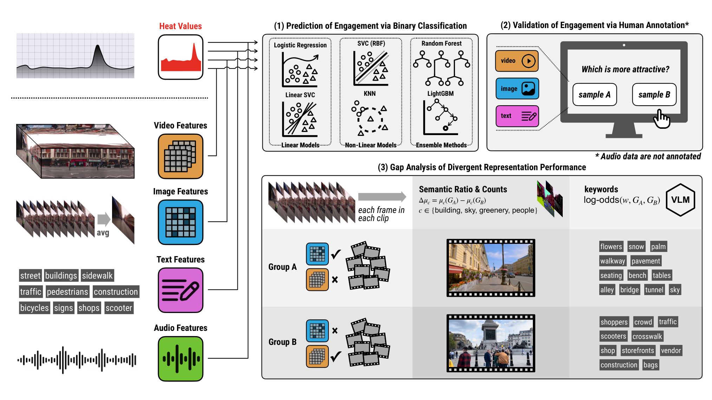

```{=html}
<style>
.quarto-title-banner {
  background-position: 50% 48%;
  height: 220px;
}
</style>
```

::: {.callout-note}
## Research context

**Independent research collaboration led by Liu Liu**<br>
Coauthors: Freya Huying Tan and Fábio Duarte

This project is an independent research strand on urban visual experience. It is not a City Form Lab project and is not presented as a chapter of the dissertation.
:::

# Research question

Video retains motion and temporal order, so it is often treated as a richer representation than a still image. Richer, however, does not necessarily mean closer to human judgment. Sidewalk Moments asks which visual representations best preserve the moments that viewers find engaging while moving through a city.

# Study design

The study uses **61 first-person city-walk videos from YouTube**, segmented into more than **50,000 ten-second clips**. Each clip is represented in four ways:

- spatiotemporal video features;
- temporally averaged images;
- audio embeddings; and
- text-based semantic descriptions.

The analysis first compares these representations with a continuous engagement signal derived from viewer replay behavior. It then tests their ability to classify high- and low-engagement moments. An independent two-alternative forced-choice experiment provides a separate comparison with human judgments.



*Study framework linking four representations to engagement prediction, human validation, and analysis of cases in which video and temporally averaged images diverge.*

# Main finding

Video features align most strongly with the continuous engagement signal, following the expected ordering by temporal richness. That ordering changes in binary classification. Temporally averaged images match or outperform video across most tested classifiers and thresholds, and participants in the human study identify engaging moments with comparable accuracy from temporally averaged images and full clips.

The gap analysis suggests that the two representations retain different information. Video performs better in activity-driven scenes with dynamic content, while temporally averaged images align more closely with judgments in scenes dominated by stable spatial composition.

# Paper and presentation

> Liu, L., Tan, F. H., & Duarte, F. (2026). "Sidewalk Moments: Are Richer Representations Always More Human-Aligned? Evidence from City-Walk Videos." Submitted to *Scientific Reports*. Under review. [arXiv](https://arxiv.org/abs/2607.20903)

The work was presented at the **2026 Annual Meeting of the American Association of Geographers** in San Francisco. [Presentation materials](../../presentations/#sidewalk-moments-are-richer-visual-representations-always-more-human-aligned-in-urban-experience)
