```{=html}
<style>
.quarto-title-banner {
  background-position: 50% 50%;
  height: 200px;
}
</style>
```

::: callout-tip
## PROJECT BRIEF

StreeTalk links street-view imagery, human perception data, and computer vision to pedestrian route choice. I led the development of a perception-modeling and routing workflow that estimated perceived street safety and allowed users to compare walking routes using both distance and visual-environment scores. The broader data pipeline processed more than 100 million images and produced perceived-safety maps for more than 300 cities in China. In 2018, the work was adapted for a commissioned application with Daimler Innovation Lab.

-   [Zhang, F., Zhou, B., Liu, L., Liu, Y., Fung, H. H., Lin, H., & Ratti, C. "Measuring human perceptions of a large-scale urban region using machine learning." *Landscape and Urban Planning*.](https://www.sciencedirect.com/science/article/pii/S0169204618308545)

-   [Liu, L., Zhang, F., Zhou, B., Wang, Z., & Li, Y. "StreeTalk: A navigation system for pedestrians and cyclists." *Landscape Architecture Frontiers*.](https://oversea.cnki.net/knavi/JournalDetail?pcode=CJFD&pykm=jgsj)
:::

# The Idea
---

The project began with a practical route-choice problem: a navigation app suggested a short walking route whose physical environment felt poorly maintained, enclosed, and uncomfortable. That experience raised a broader question: could street-view imagery and human perception data help a routing system account for the visual experience of walking, rather than distance alone?

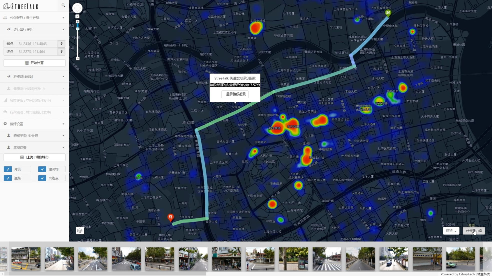

In 2016, shortly after I moved to a new apartment in Shanghai, Amap suggested a walking route to a nearby restaurant. The suggested route included deteriorated pavement, limited lighting, long blank walls, and few visible signs of pedestrian activity. These conditions motivated an experiment in modeling perceived street safety and incorporating it into pedestrian navigation.

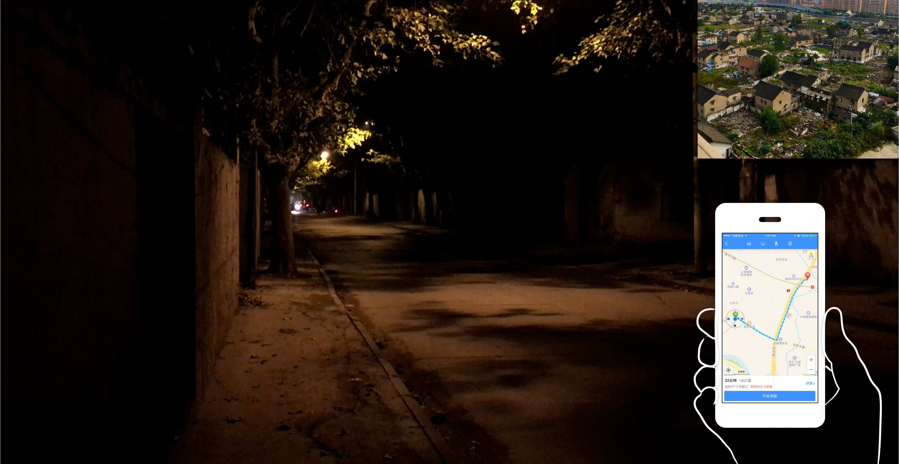

# Modeling Perceived Street Safety
---

I trained a street-view classifier to estimate perceived-safety scores and used its outputs to build a citywide perception map of Shanghai. The resulting software connected image-based scores to street segments, creating the spatial layer required for perception-aware pedestrian routing.

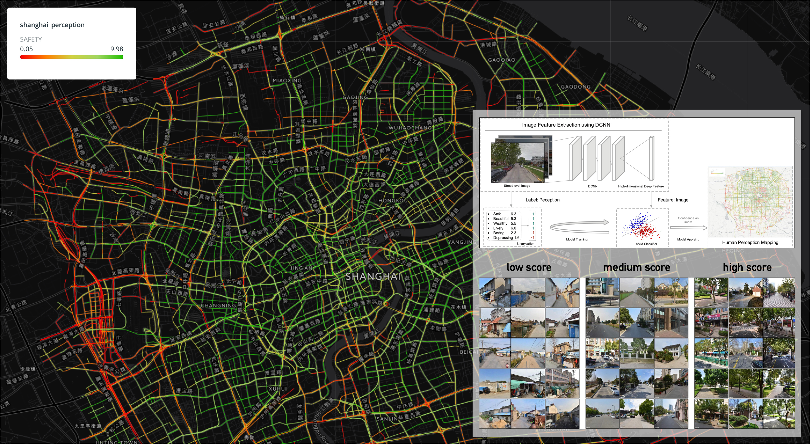

# Demo Video
---

Below is a demo video showing how the perceived-safety score is applied for pedestrian routing.




# Revisit the Dataset and Algorithm
---

The following sections document a later technical revisit of the perception datasets and modeling workflow used in this line of research.

## Place Pulse 2.0

A significant source of street perception data is the ["Place Pulse" project](https://centerforcollectivelearning.org/urbanperception). It collects public feedback on various urban areas using a pairwise labeling interface. Initiated in 2010, the project's website showcases roughly 4,000 images from four cities: Boston, New York, Linz, and Salzburg. As shown in Figure 1, it gauges public perception across six dimensions. Participants are presented with pairs of street views and asked, "Which image looks safer?"

Over the years, the dataset was enhanced to version 2.0, which includes 110,998 random street-view images gathered from 56 cities in 28 countries across six continents. From 2013 to 2016, 81,630 online participants took part in the survey, providing over 1,170,000 pairwise comparisons. Its geographic and participant coverage made it a useful large-scale benchmark for studying perceived qualities of urban scenes, while still requiring care when transferring models across local contexts.

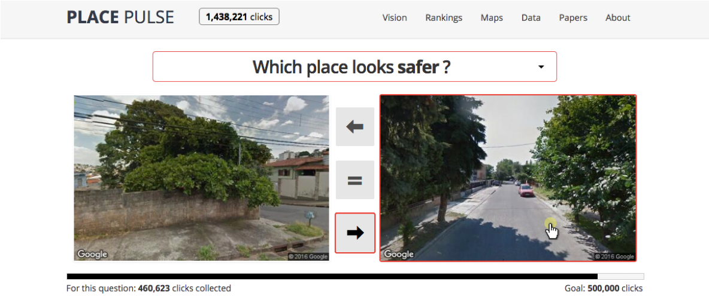


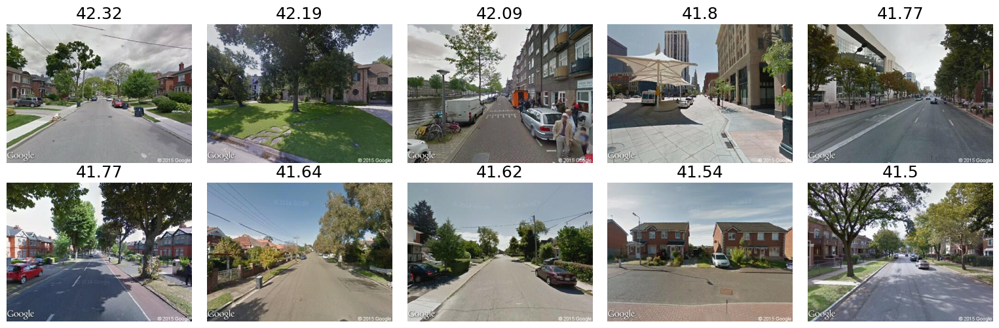{width=100%}

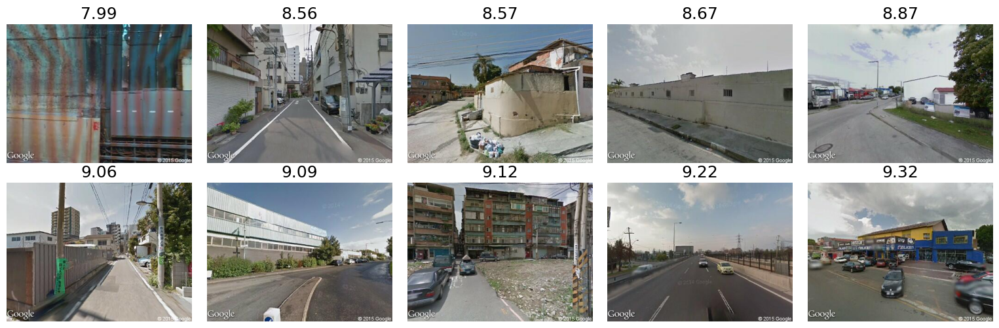{width=100%}

## Binary SVM for Baseline Measurement

As a baseline, I trained binary support vector machine classifiers for the six perception dimensions and compared their predictive accuracy. The accuracy results for all six models are shown below.

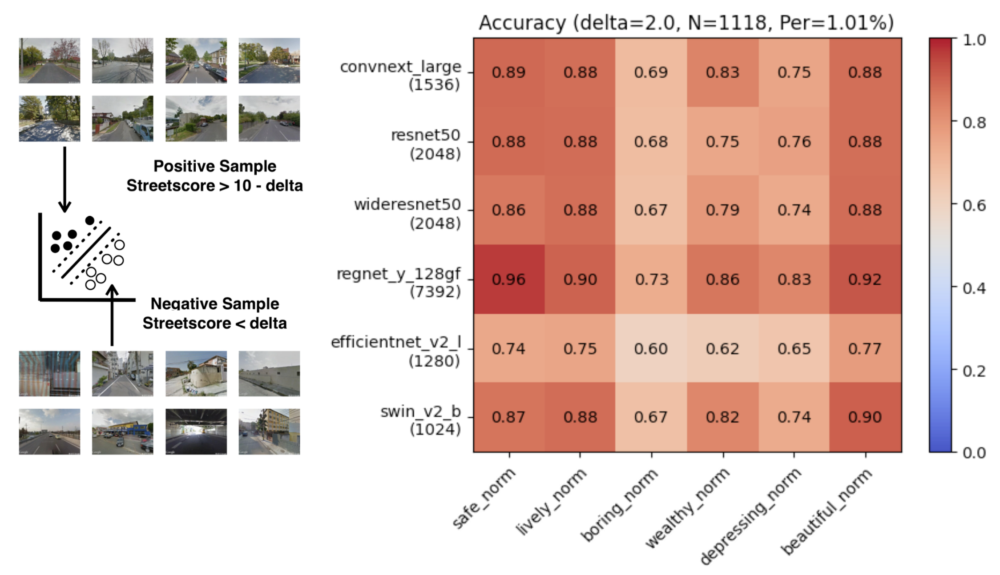{width=49%}
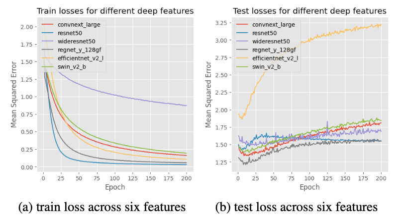{width=49%}

## Class Activation Maps for Street-View Images

Class activation maps provide a visual diagnostic of the image regions contributing to positive and negative model predictions. They help inspect model attention, but should not be treated as direct evidence of human attention or causal environmental effects. Below are negative and positive samples from the updated models.

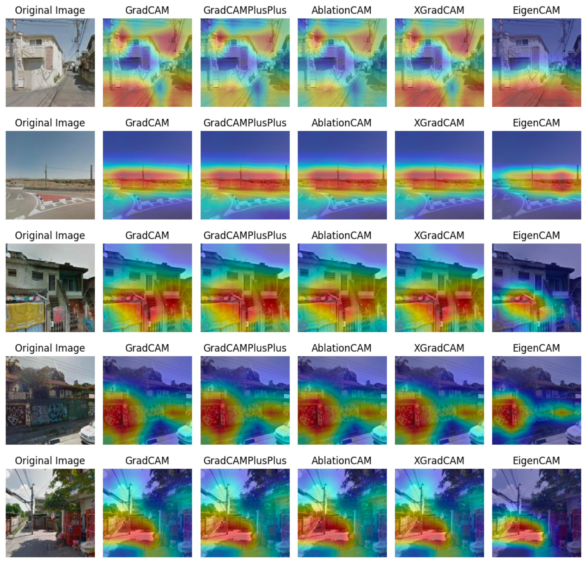{width=100%}

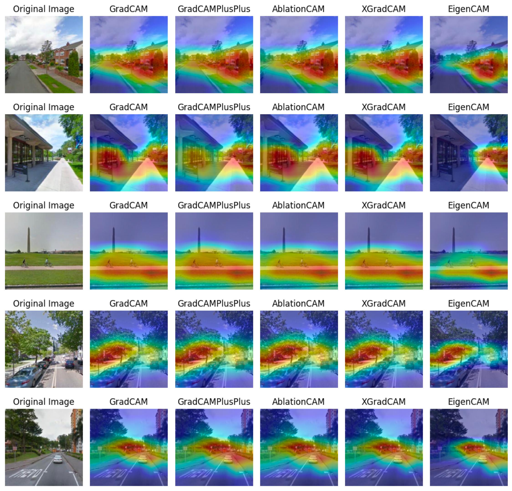{width=100%}

# Collaboration with Daimler

In 2018, the project delivered perceived-safety maps for more than 300 cities in China for a Daimler Innovation Lab application. The spatial scores supported pedestrian route alternatives that considered both network distance and modeled street perception.

As part of client validation, Daimler supplied a set of non-standard test images, including scenes outside the street-view conditions represented in the training data. The model's response to these images, including a nighttime scene, helped the team discuss generalization limits and increased the client's confidence in proceeding with the commissioned application. This exercise was an applied validation step, not a substitute for systematic out-of-distribution evaluation.

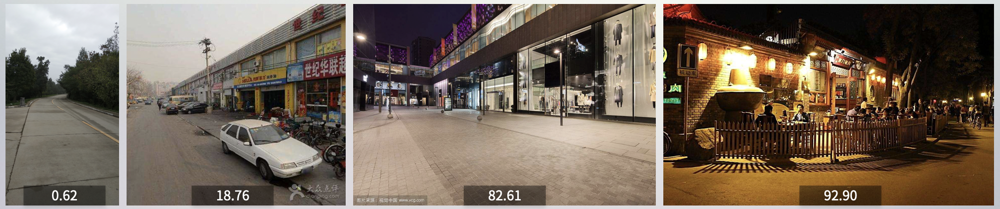{width=100%}

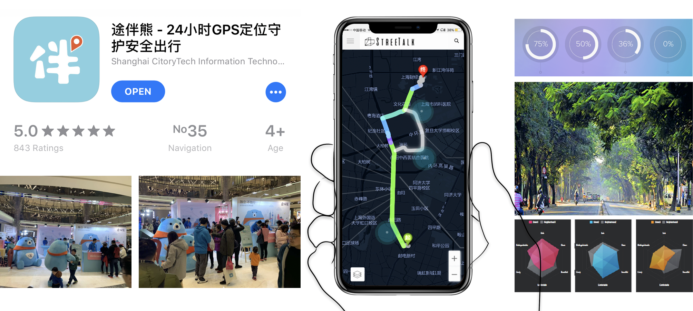{width=100%}
