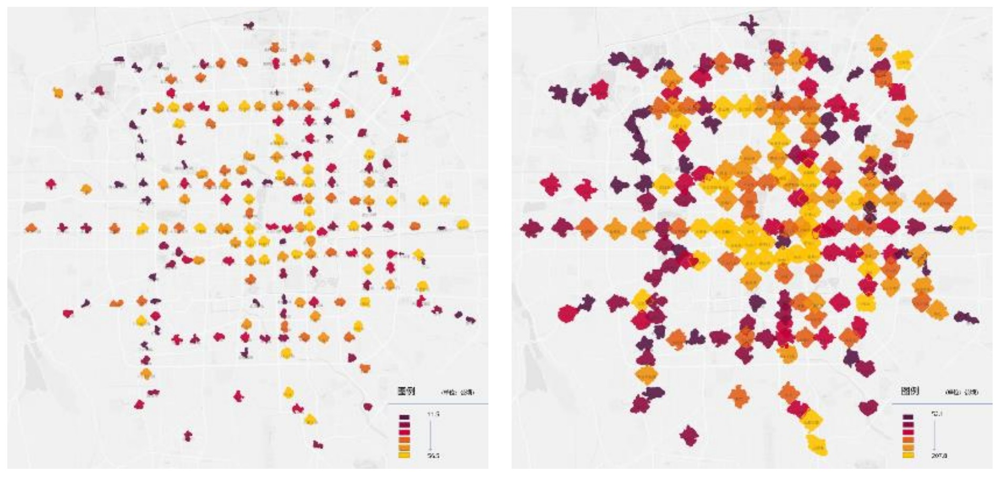
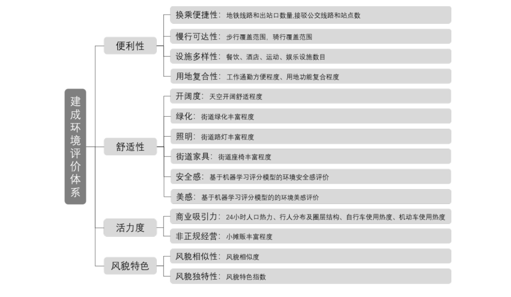
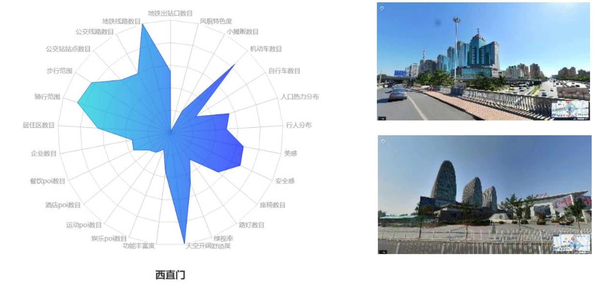

```{=html}
<style>
.quarto-title-banner { --banner-overlay: rgba(0, 0, 0, 0.6); }
</style>
```

::: {.callout-note}
## Project context

**Transit-oriented development research at CitoryTech · Beijing · 2019**<br>
My role: Project lead; founder and research director of CitoryTech.
:::

# The question

A metro station can be well connected to the transit network while offering an uncomfortable or inconvenient walk outside its entrances. I led this project at CitoryTech to evaluate **station-area environments from the pedestrian’s perspective**, connecting transport access with the quality and character of surrounding streets.

The principal analysis covered **201 operating metro stations within Beijing’s Fifth Ring Road**. Ten-minute walking catchments defined the study areas, allowing the assessment to follow the street network and actual walking access around each station.

{fig-alt="Two maps of Beijing metro stations showing five-minute walking catchments on the left and ten-minute catchments on the right." loading="lazy"}

# An integrated assessment

Our team combined street-view image analysis, perception modeling, points of interest, transport connections, and spatial measures. The assessment organized this evidence into four complementary dimensions.

| Dimension | Evidence examined |
|---|---|
| Convenience | Transfer opportunities, walking and cycling access, service diversity, and land-use mix |
| Comfort | Sky visibility, greenery, lighting, street furniture, and model-estimated perceptions of safety and beauty |
| Vitality | Activity-related observations and the presence of commercial and informal uses |
| Visual character | Similarities and differences in station-area streetscapes |

The report also explored station-interior observation through a pilot at Jinshajiang Road station in Shanghai and described a crowdsourced image-collection workflow. The Beijing station-area analysis remained the main comparative assessment.

{fig-alt="Indicator hierarchy for the station-area assessment, with four main dimensions and their constituent transport, environmental, activity, and streetscape measures." loading="lazy"}

# From comparison to station diagnosis

Station profiles connected the scores back to local street conditions. For example, the Xizhimen profile paired its strong transport connections with concerns about comfort, street activity, and the environment around a major interchange. The report used these profiles to discuss possible improvements to lighting, seating, pedestrian facilities, and service provision.

{fig-alt="Radar chart of Xizhimen station-area indicators, accompanied by two street-view images of its surroundings." loading="lazy"}

# My role and project output

I led the CitoryTech team’s work on this project. The report assembled a common evaluation framework, comparative station maps, and detailed station profiles to support discussion of **targeted station-area improvements**.

Street-view observations describe the conditions captured in the imagery. Perceived-safety scores represent visual judgments, while people or vehicles visible in an image are observations rather than measured traffic flows. These distinctions matter when translating the assessment into planning decisions.

Figures: CitoryTech project report, 2019. Related work: [CityEye](../cityeye/), the collaborative image-collection tool described in the report, and the [earlier Nanjing street-environment visualization](../../visualization/#visual-comfortness-2018).
