```{=html}
<style>
.quarto-title-banner {
  background-position: 50% 50%;
  height: 200px;
}
</style>
```
::: callout-tip
## PROJECT BRIEF

VibeScan is a commercial-district benchmarking and customer-analysis system developed through CitoryTech for Hongkong Land's West Bund Financial City work. I led the integration of social-media comments and images, points of interest, and spatial data to compare how visitors responded to design, programming, amenities, and operations across international and Chinese commercial districts. Phase I analyzed approximately 14 million records from international reference cases; Phase II analyzed approximately 7 million records from recently developed Chinese cases. The resulting evidence supported planning, design, tenant strategy, and operational decision-making.

For a detailed demonstration of the project, please refer to the slides: [Phase I](https://www.dropbox.com/scl/fi/9e1rhg07vftm3qkmwo6i5/0323.pdf?rlkey=hhmkl61vt7ip7kt06c5k7nc5k&dl=0) and [Phase II](https://www.dropbox.com/scl/fi/qgla46f59s2kmdm21dwq8/0531.pdf?rlkey=t6zcpi2w1igjsqwm9edimas37&dl=0).
:::

# The Idea
---

Commercial districts invest heavily in public-space design, temporary installations, events, and amenities, but conventional performance indicators reveal little about which interventions attract attention, encourage visits, or shape public response. VibeScan treats publicly available online comments and images as an additional evidence source for comparing spatial and operational strategies across districts. The aim is not to replace surveys or financial analysis, but to connect observable public response with specific places, facilities, and design decisions.

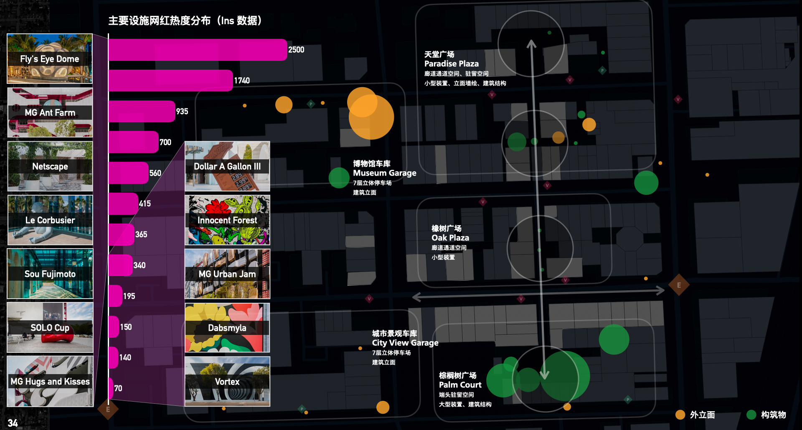


# Data Process
---
The workflow collected publicly available comments and user-contributed images from multiple social-media platforms in China and the United States. Records were cleaned, geolocated where possible, and organized around districts, destinations, facilities, events, and recurring topics. Phase I analyzed approximately 14 million records from established international cases; Phase II analyzed approximately 7 million records from recently developed Chinese cases. The project combined text mining, image analysis, point-of-interest data, and spatial comparison to produce district-level benchmarks.

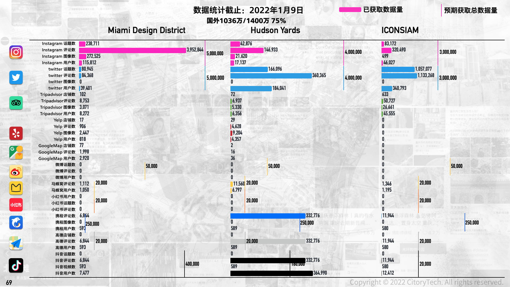

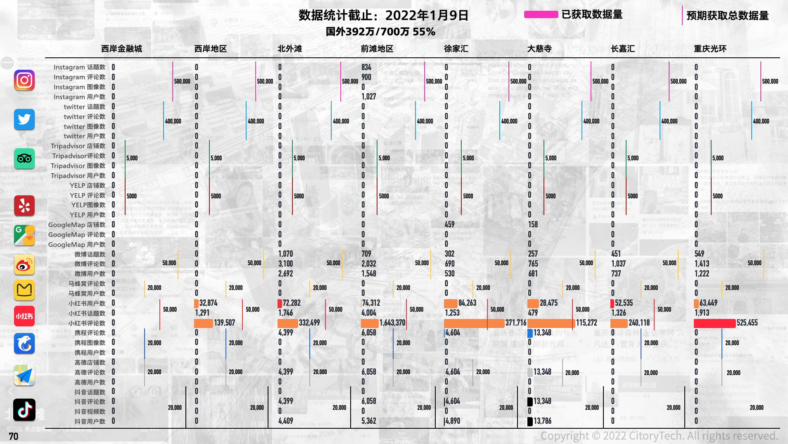


# Key Results
---

## Miami Design District Benchmark

### Search Interest Across Platforms

Search-index trends were compared across Chinese and U.S. platforms to show how much online attention the district attracts on each channel and how that attention changes over time. This helps operators understand where public conversation about a district actually takes place.

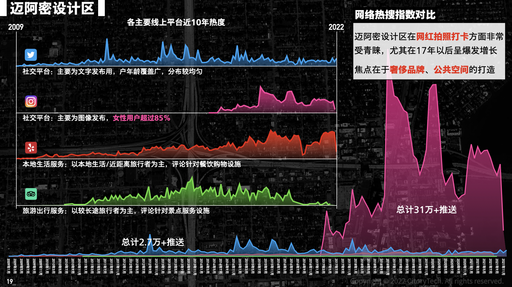

### Brand and Visitor Check-In Patterns

Check-in records were organized by brand and over time to show which tenants draw visits and how visitor activity fluctuates. The comparison supports tenant-mix and programming discussions by making each brand's drawing power visible.

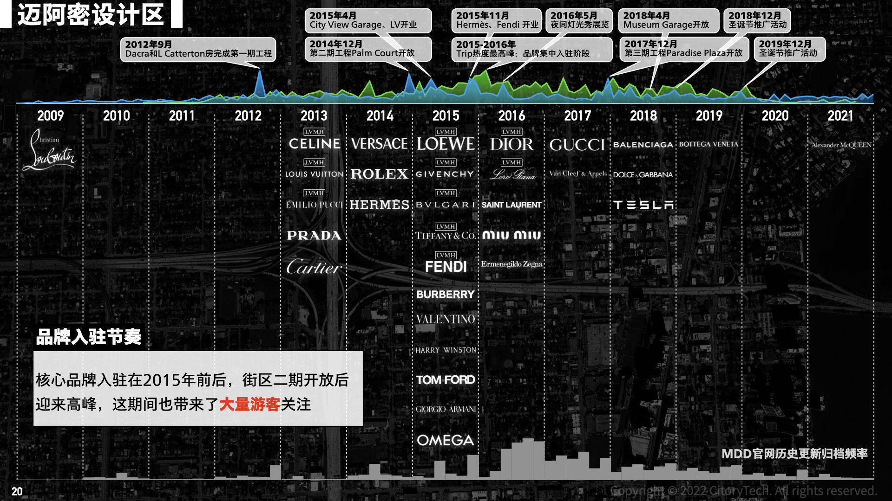

### Spatial Investments and Influencer Attention

These charts relate leading merchants' investments in space and installation design to subsequent check-in and creator/influencer activity. The comparison is descriptive: it shows which spatial investments coincided with online attention, without asserting a causal effect.

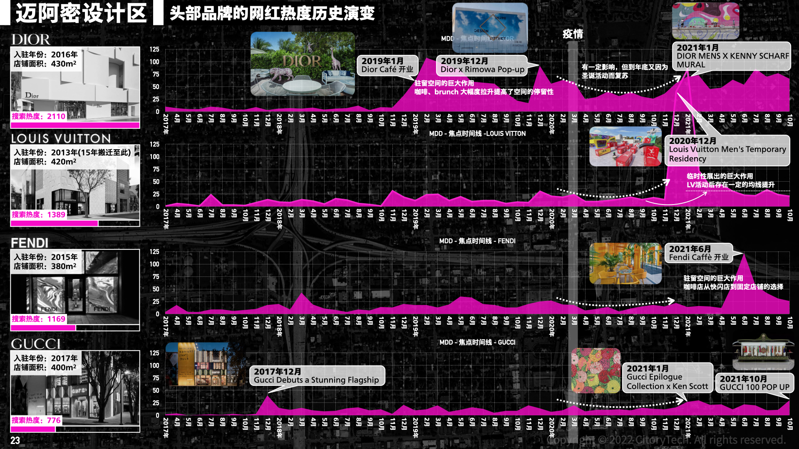

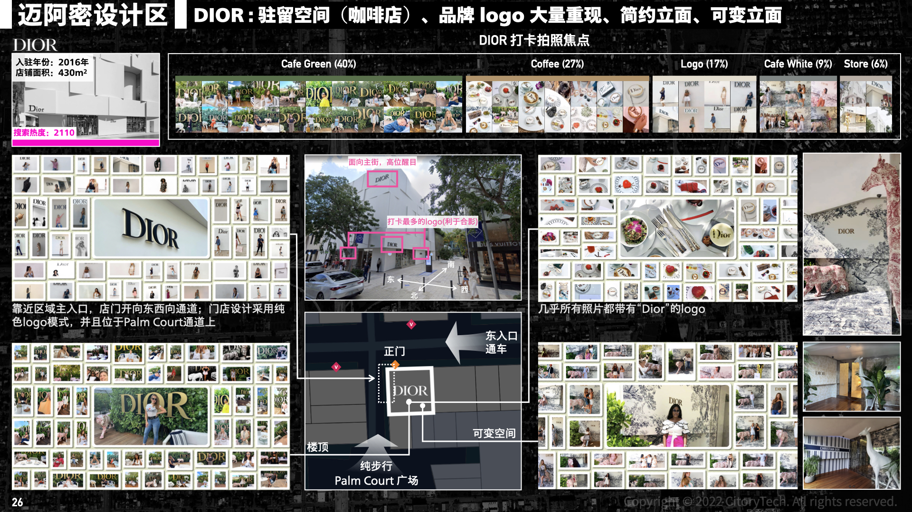

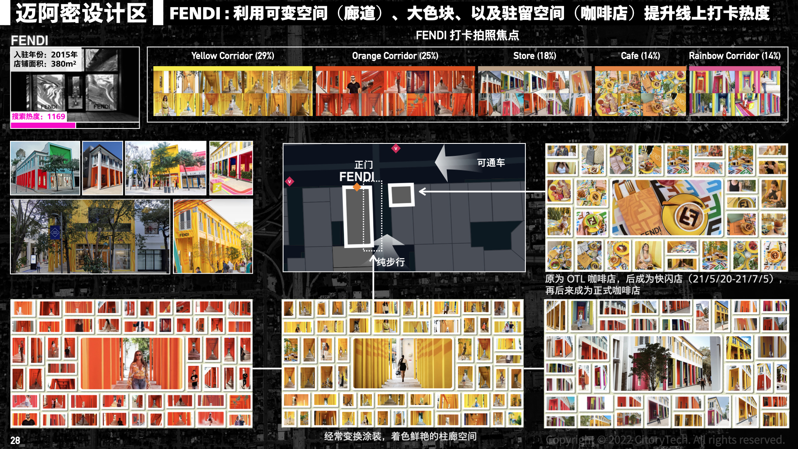

### Use of Public Amenities

Comments and images referencing public facilities in the district's main spaces were used to compare how amenities are actually used and discussed by visitors, informing decisions about which facilities merit investment.

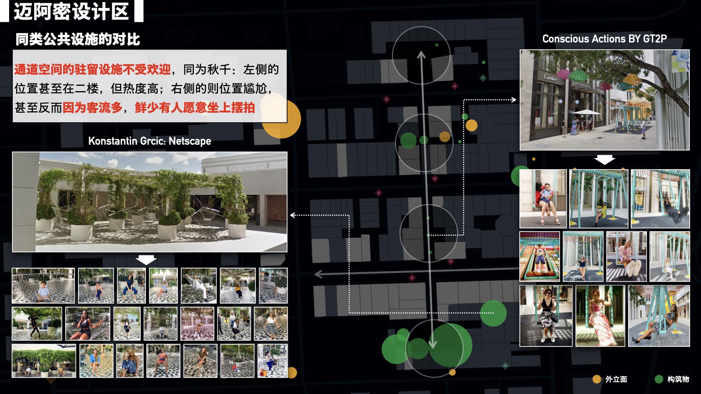

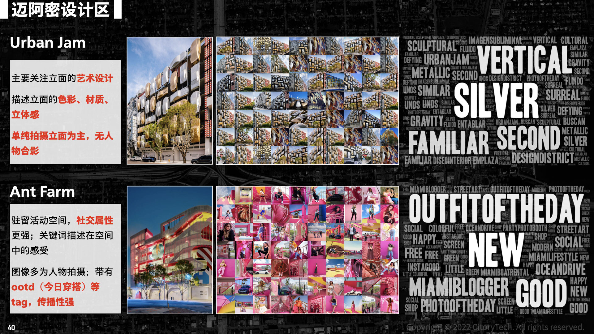

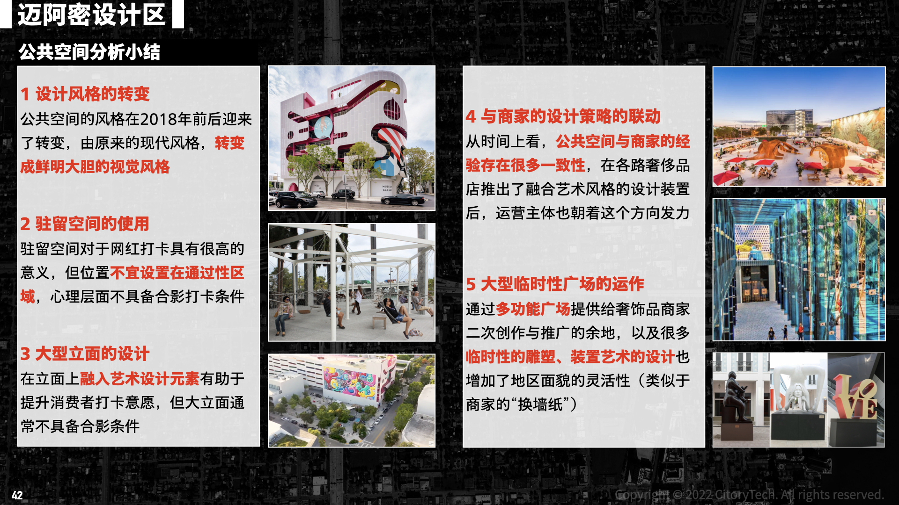

## Hudson Yards Benchmark

### Search Interest Across Platforms

Search-index trends for Hudson Yards were compared across platforms, parallel to the Miami Design District analysis, to benchmark the district's online visibility.

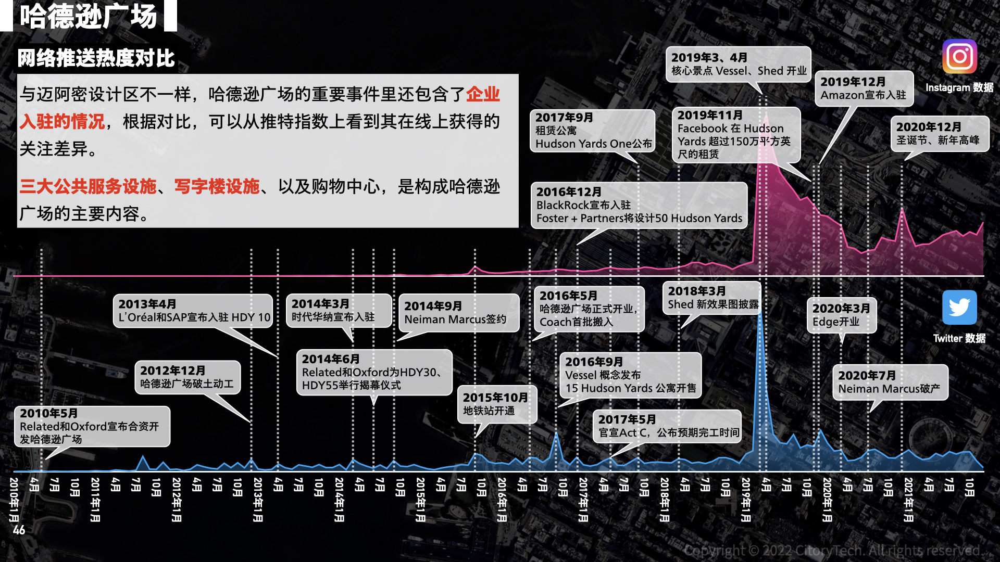

### Estimated Visitor Composition

Publicly available profile and content signals were used to estimate the composition of the visiting population, supporting comparisons of which audiences each district attracts.

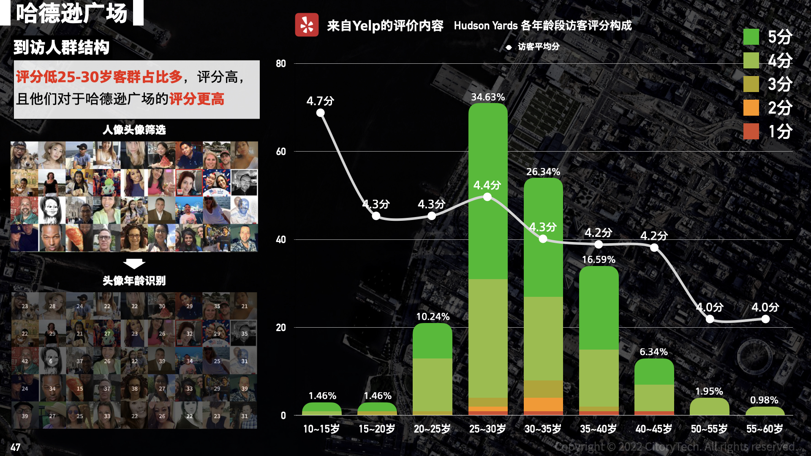

### Public Response to Vessel

Comments mentioning Vessel were mined for recurring topics and sentiment, showing how the public responded to the district's signature landmark.

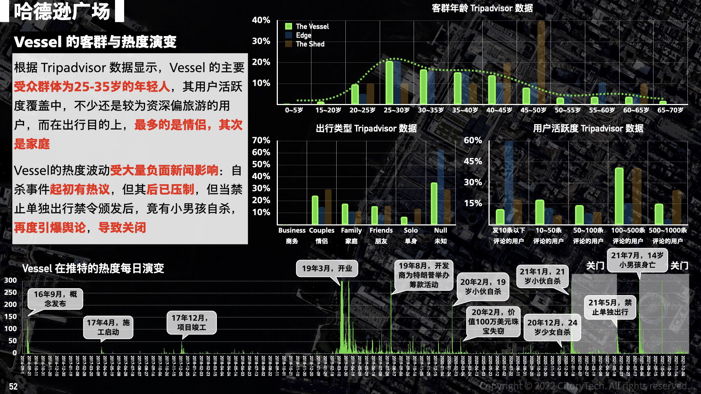

### Public Response to Edge

Comments mentioning the Edge observation deck were analyzed the same way, indicating how a paid attraction contributes to the district's public profile.

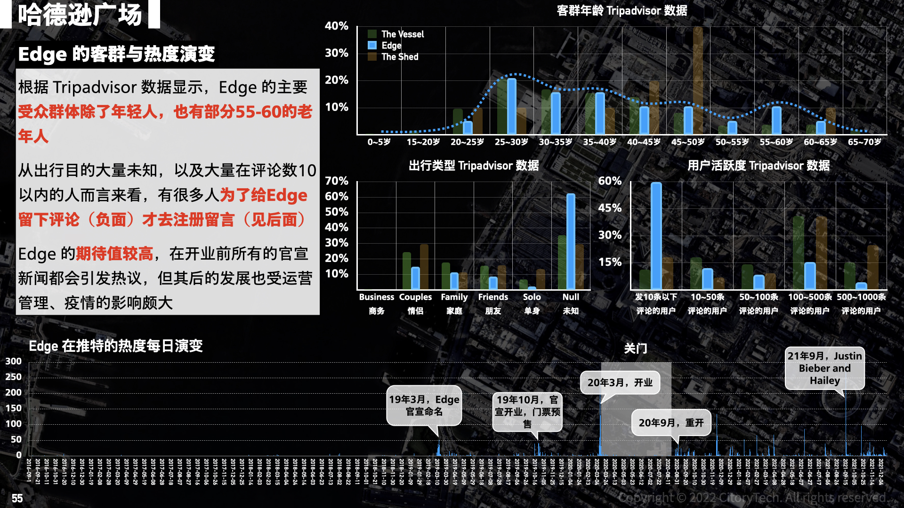

### Public Response to The Shed

Comments mentioning The Shed were analyzed to show how a cultural venue shapes public response to the district.

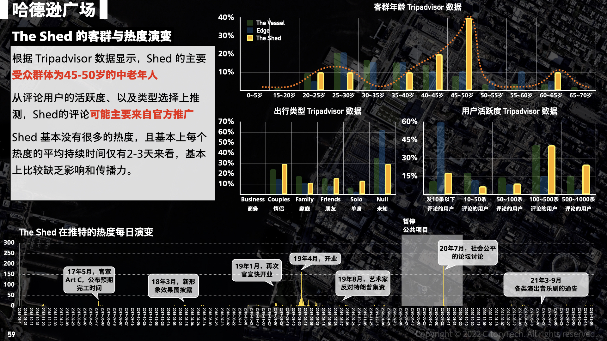

# Client Deliverable

The project translated the benchmarking results into a spatial decision-support package for the West Bund Financial City context. Deliverables connected public response and customer patterns to design features, amenities, reference projects, and operational strategies. The work was intended to help the client compare precedents and prioritize questions for planning, design, leasing, and district operations.

For a detailed demonstration of the project, please refer to the slides: [Phase I](https://www.dropbox.com/scl/fi/9e1rhg07vftm3qkmwo6i5/0323.pdf?rlkey=hhmkl61vt7ip7kt06c5k7nc5k&dl=0) and [Phase II](https://www.dropbox.com/scl/fi/qgla46f59s2kmdm21dwq8/0531.pdf?rlkey=t6zcpi2w1igjsqwm9edimas37&dl=0).
