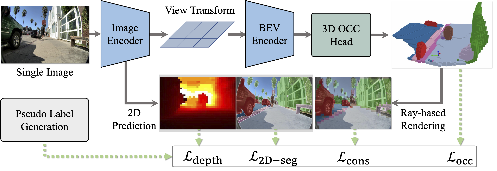

```{=html}
<style>
.quarto-title-banner {
  background-position: 50% 50%;
  height: 220px;
}
</style>
```

::: {.callout-note}
## Research context

**Collaborative research at UCLA's Vision and Autonomy Intelligence Lab**<br>
My role: Key collaborator on the 2D semantic component

This page distinguishes my contribution from the complete 3D occupancy framework developed by the broader author team.
:::

# Project overview

WalkOCC studies monocular 3D semantic occupancy perception for robots moving through sidewalks and crossings. The full project combines limited paired LiDAR and RGB sequences with a larger collection of 2D-only images. A ray-marching consistency objective connects 2D semantic supervision with 3D occupancy learning.

The resulting framework addresses a practical constraint in sidewalk robotics: paired 3D sensor data and occupancy annotations are expensive, while monocular street imagery is much easier to collect at scale.



*Overview of the hybrid 2D and 3D learning framework. Figure from the WalkOCC project page.*

# My contribution

My work focused on the 2D semantic component rather than the 3D architecture. I:

- fine-tuned SAM 3 on sidewalk-robot imagery to segment fine-grained elements including curbs, gutters, crosswalks, and driveways;
- participated in discussions of the semantic taxonomy and evaluation design;
- audited annotations and identified inconsistencies, including rider versus motorcycle segmentation and ambiguous driveway versus sidewalk boundaries; and
- supported the hybrid study's 2D semantic component and coauthored the manuscript.

These tasks draw on my urban visual research, particularly the definition and validation of street-level categories, while extending it toward environments shared by pedestrians and autonomous machines.

# Paper and project links

> Ma, Y., Lin, J., Liu, L., He, H., Ricketts, L., Squicciarini, B., Liu, Y., & Zhou, B. (2026). "Monocular 3D Occupancy Perception for Robots on Sidewalks via Hybrid 2D–3D Learning." Available as an arXiv preprint; revised manuscript in preparation.

- [Official project page](https://vail.cs.ucla.edu/walkocc/)
- [arXiv preprint](https://arxiv.org/abs/2606.19122)
